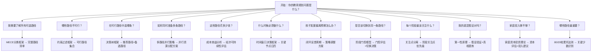

# 🧭 快速参考：教育规划框架

| # | 框架 📋 | 80/20 | 何时使用 | 关键洞察 |
|---|---------|:-----:|----------|----------|
| 1 | **决策树框架** 🌳 | ★★★★★ | 每个升学节点（幼升小/小升初/中考/高考） | 约束驱动的分支判断——先排除不可能的，再在可能中选择最优的 |
| 2 | **约束过滤框架** 🚪 | ★★★★★ | 决策树之前的快速筛选 | 先做减法再做选择题——硬门槛不可变通，软约束可以提升 |
| 3 | **多路径并行策略** 🛡️ | ★★★★☆ | 任何存在不确定性的升学节点 | 保底80%+进取15%+期权5%——不把鸡蛋放在一个篮子里 |
| 4 | **成本效益分析** 💰 | ★★★★☆ | 民办vs公办选择、家庭经济压力评估 | 高投入≠高产出——全公办7万vs全民办150万，高考出口未必不同 |
| 5 | **闭环反馈周期** ♻️ | ★★★☆☆ | 每个教育阶段的中期和末期 | 应用→测量→学习→调整——教育是15年动态过程，不是一次性决策 |
| 6 | **时间窗口决策框架** ⏰ | ★★★☆☆ | 制定年度行动计划、接近升学节点 | 时间不可逆——错过窗口等待一年，优先级高于一切 |

---

## 决策流程图

---

*快速参考卡 from framework_guidance_agent v1.0.0*
