# 🕸️ 实体关系图：成都升学规划ER图

**版本**: v3.3.0 | **日期**: 2026-07-03 | **格式**: Mermaid Flowchart (支持方向指示) | **方向指示**: 启用 | **强度可视化**: 启用 | **实体Emoji**: 启用

---

%% Alt: 成都升学规划实体关系图 — 展示85个核心实体及其105条关系，覆盖8类MECE关系

```mermaid
flowchart TD
    %% ==================== 教育阶段顺序流 ====================
    E001["🏠 幼儿园"] -->|"⏩ precedes"| E002["🏠 小学"]
    E002 -->|"⏩ precedes"| E003["🏠 初中"]
    E003 -->|"⏩ precedes"| E004["🏠 高中"]
    E004 -->|"⏩ precedes"| E005["🏠 大学"]
    E056["🧠 幼小衔接"] -->|"⏩ transitions to"| E002
    E048["📅 中考"] -->|"⏩ leads to"| E004
    E049["📅 高考"] -->|"⏩ leads to"| E005

    %% ==================== 层级关系 ====================
    E016["🏠 成都七中"] -->|"🌳 inherits from"| E014["🏠 四七九名校"]
    E015["🏠 石室中学"] -->|"🌳 inherits from"| E014
    E017["🏠 树德中学"] -->|"🌳 inherits from"| E014
    E022["🏠 英才学校"] -->|"🌳 inherits from"| E016
    E024["🏠 49中"] -->|"🌳 inherits from"| E017
    E018["🏠 万汇学校"] -->|"🌳 classifies as"| E026["🏫 公办民管学校"]
    E023["🏠 嘉祥外国语学校"] -->|"🌳 classifies as"| E027["🏫 民办学校"]
    E039["🧩 强基计划"] -->|"🌳 specializes"| E049
    E040["🧩 综合评价招生"] -->|"🌳 specializes"| E049
    E041["🧩 保送生"] -->|"🌳 specializes"| E049
    E042["🧩 少年班"] -->|"🌳 specializes"| E049
    E050["📅 四川高考"] -->|"🌳 specializes"| E049
    E051["📅 贵州高考"] -->|"🌳 specializes"| E049
    E009["📍 成华区"] -->|"🌳 specializes"| E008["📍 5+2区域"]
    E010["📍 青羊区"] -->|"🌳 specializes"| E008

    %% ==================== 组合关系 ====================
    E014 -->|"🧩 contains"| E015
    E014 -->|"🧩 contains"| E016
    E014 -->|"🧩 contains"| E017
    E018 -->|"🧩 contains"| E019["🏠 万汇小学"]
    E031["⚖️ 指标到校"] -->|"🧩 comprises"| E080["📊 市级统分指标"]
    E031 -->|"🧩 comprises"| E081["📊 区级指标"]
    E057["🧠 家庭教育"] -->|"🧩 contains"| E058["🧠 学习习惯"]
    E057 -->|"🧩 contains"| E059["🧠 心理韧性"]
    E057 -->|"🧩 contains"| E060["🧠 阅读习惯"]
    E061["🧠 三个地基"] -->|"🧩 contains"| E060
    E061 -->|"🧩 contains"| E058
    E061 -->|"🧩 contains"| E059
    E052["📅 志愿填报"] -->|"🧩 comprises"| E078["📝 院校专业组"]

    %% ==================== 语境关系 ====================
    E014 -->|"🌐 located in"| E007["📍 成都市"]
    E009 -->|"🌐 located in"| E007
    E008 -->|"🌐 located in"| E007
    E018 -->|"🌐 located in"| E009
    E046["🧩 少数民族加分政策"] -->|"🌐 operates within"| E013["📍 三州十七县两区"]
    E054["👤 布依族"] -->|"🌐 located in"| E011["📍 贵州省"]
    E072["🏢 四川省教育考试院"] -->|"🌐 operates within"| E006["📍 四川省"]
    E073["🏢 成都市教育局"] -->|"🌐 operates within"| E007
    E045["🧩 异地高考"] -->|"🌐 operates within"| E006

    %% ==================== 因果关系 (强) ====================
    E037["⚖️ 人户一致"] ==>|"⚡ enables"| E028["⚖️ 划片入学"]
    E075["📋 户籍"] ==>|"⚡ enables"| E028
    E035["⚖️ 落户年限"] -->|"⚡ constrains"| E028
    E036["⚖️ 六年一学位"] -->|"⚡ constrains"| E065["💰 学区房"]
    E058 ==>|"⚡ influences"| E048
    E057 ==>|"⚡ produces"| E058
    E057 -->|"⚡ produces"| E059
    E047["🧩 三统一要求"] ==>|"⚡ constrains"| E046
    E046 -->|"⚡ enables"| E049
    E039 -->|"⚡ enables"| E005
    E031 ==>|"⚡ enables"| E004
    E080 -->|"⚡ enables"| E014
    E056 -->|"⚡ facilitates"| E002
    E076["📢 双减政策"] -->|"⚡ facilitates"| E056
    E077["📢 课后服务"] -->|"⚡ enhances"| E057
    E032["⚖️ 公民同招"] ==>|"⚡ prevents"| E083["⚙️ 民办掐尖招生"]
    E028 ==>|"⚡ enables"| E033["⚖️ 免试就近入学"]
    E045 -->|"⚡ enables"| E055["👤 随迁子女"]
    E074["📋 学籍"] -->|"⚡ enables"| E045
    E074 -->|"⚡ constrains"| E031
    E060 -->|"⚡ enhances"| E049
    E018 -->|"⚡ enables"| E082["⚙️ 九年一贯制直升"]
    E073 -->|"⚡ produces"| E028
    E069["🧩 多路径并行策略"] -->|"⚡ reduces"| E085["⚙️ 升学风险"]
    E059 -->|"⚡ enables"| E062["🧠 逆境逆袭"]
    E034["⚖️ 统筹安排"] -->|"⚡ produces"| E084["⚙️ 兜底学位"]
    E052 -->|"⚡ determines"| E005
    E079["📝 平行志愿"] -->|"⚡ enables"| E052

    %% ==================== 对比关系 ====================
    E050 ---|"↔️ differs from"| E051
    E029["⚖️ 大摇号"] ---|"↔️ contrasts with"| E030["⚖️ 小摇号"]
    E063["💰 公办学费"] ---|"↔️ contrasts with"| E064["💰 民办学费"]
    E010 ---|"↔️ comparable to"| E009
    E039 ---|"↔️ contrasts with"| E040
    E012["📍 绵阳"] ---|"↔️ comparable to"| E007

    %% ==================== 推断关系 (虚线) ====================
    E070["🧩 时间窗口决策框架"] -.->|"⚡ enables [INFERRED]"| E052
    E066["🧩 MECE分类框架"] -.->|"⚡ enables [INFERRED]"| E067["🧩 决策树框架"]
    E068["🧩 约束过滤框架"] -.->|"⚡ enables [INFERRED]"| E067
    E071["🧩 闭环反馈周期"] -.->|"⚡ improves [INFERRED]"| E069
```

---

## 图表说明

**实体Emoji图例**:
- 🏠 教育阶段/学校实体
- 🏫 学校类型实体
- 📍 地理区域实体
- ⚖️ 政策制度实体
- 🧩 升学路径/框架实体
- 📅 考试评估实体
- 👤 人群实体
- 🧠 儿童发展实体
- 💰 经济实体
- 🏢 组织机构实体
- 📋 法律概念实体
- 📢 政策补充实体
- 📝 招生机制实体
- 📊 指标组件实体
- ⚙️ 机制/结果实体

**关系类别Emoji图例**:
- 🌳 层级关系（Tree Map）
- 🧩 组合关系（Brace Map）
- 🌐 语境关系（Circle Map）
- 💭 属性关系（Bubble Map）
- ↔️ 对比关系（Double Bubble Map）
- ⏩ 顺序关系（Flow Map）
- ⚡ 因果关系（Multi-Flow Map）
- 🌉 类比关系（Bridge Map）

**线条强度图例**:
- `==>` 粗线：强关系（置信度≥0.85）
- `-->` 普通线：标准关系（置信度0.7-0.84）
- `-.->` 虚线：推断关系（标注[INFERRED]）
- `---` 无方向线：对比关系

---

*实体关系图 from entity_relationship_extractor v3.3.0*
