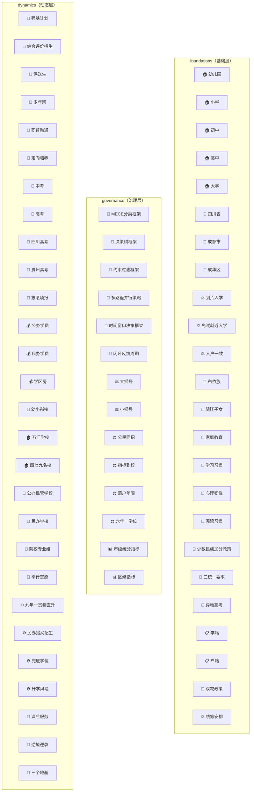
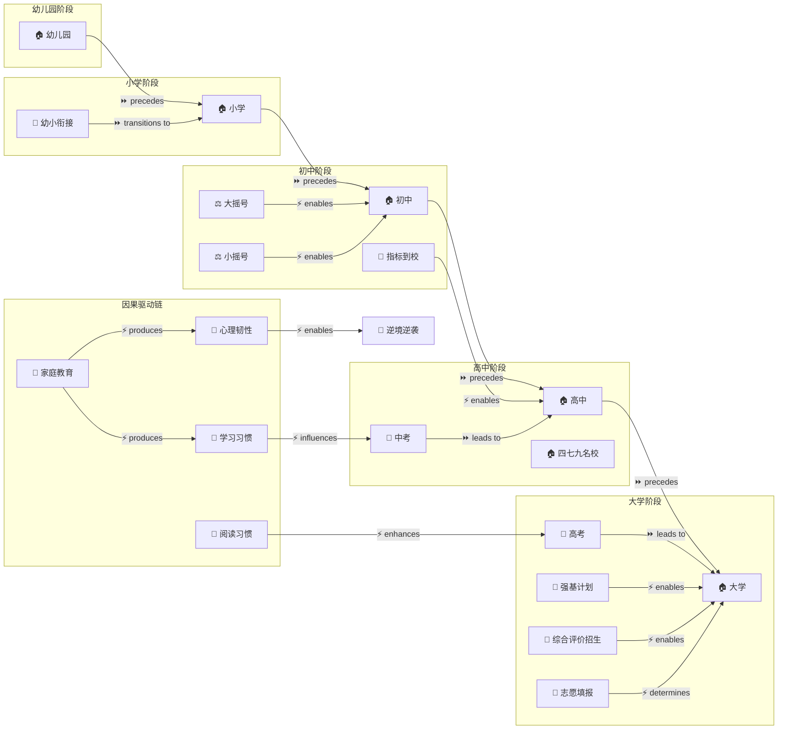
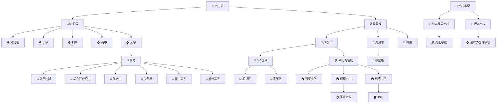

# 🏛️ 知识架构图：成都升学规划实体关系架构

**版本**: v3.3.0 | **日期**: 2026-07-03 | **架构数量**: 3 | **Token预算**: 20480 | **语言**: 中文

---

## 架构1: 分层架构（Layered Architecture）

**架构标题**: 成都升学规划三层结构模型

**架构描述**: 将85个实体按Structural Mastery Stack的三个层级（foundations/governance/dynamics）分类，展示教育规划知识体系的纵向分层结构。

**架构摘要**: 分层架构将成都升学规划实体按认知深度分为三个层级：foundations层包含教育阶段、地理区域、政策制度、法律概念、人群和儿童发展等基础事实与因果实体，构成教育规划的"现实基座"；governance层包含框架、决策工具、对比分析和部分政策制度等治理性实体，提供决策的"规则与评价体系"；dynamics层包含升学路径、考试评估、经济因素、学校类型和顺序关系等执行性实体，构成教育规划的"操作执行层"。三层之间形成自下而上的支撑关系——foundations提供事实基础→governance提供决策框架→dynamics提供执行路径。

**包含实体**: 全部85个实体

**置信度**: 1.00

**选择理由**: classify_by_layer=true，分层架构确定性包含，所有实体按layer_classification字段分配到对应层级

---

## 架构2: 流程架构（Flow Architecture）

**架构标题**: 成都升学规划升学流程图

**架构描述**: 以顺序+因果关系为主体，展示从幼儿园到大学的完整升学流程和关键因果驱动链。

**架构摘要**: 流程架构以时间轴为主线，展示教育管道的五阶段顺序流（幼儿园→小学→初中→高中→大学）及其考试分流节点（中考、高考）。核心因果链从家庭教育出发，通过学习习惯和心理韧性的复利积累驱动考试表现，最终决定升学结果。政策制度（划片入学、指标到校、大摇号、少数民族加分等）作为流程中的条件分支节点，为不同路径提供替代通道。深度因果分析显示，家庭教育的根因可追溯至父母教育理念和社会教育认知，其终极效应延伸至大学层次和职业起点。

**包含实体**: E001幼儿园、E002小学、E003初中、E004高中、E005大学、E056幼小衔接、E029大摇号、E030小摇号、E031指标到校、E048中考、E049高考、E014四七九名校、E039强基计划、E040综合评价招生、E052志愿填报、E057家庭教育、E058学习习惯、E059心理韧性、E060阅读习惯、E062逆境逆袭

**置信度**: 0.15

**选择理由**: 顺序+因果关系组合占比38.5%（最高单一架构类型），虽未达50%阈值但作为最高占比架构按fallback规则选择

---

## 架构3: 层级架构（Hierarchical Architecture）

**架构标题**: 成都升学规划分类层级树

**架构描述**: 以层级关系为主体，展示教育体系中实体间的分类和继承关系。

**架构摘要**: 层级架构以四川省教育体系为根节点，向下分支为教育阶段（幼儿园/小学/初中/高中/大学）和地理区域（成都市/贵州省/绵阳）。成都市下分为5+2区域和四七九名校两个子分支，5+2区域进一步细分为成华区、青羊区等成员区。四七九名校包含石室中学、成都七中、树德中学三个成员，英才学校继承成都七中的教研体系，49中继承树德中学。高考作为根节点向下特化为强基计划、综合评价招生、保送生、少年班、四川高考、贵州高考等特殊升学路径。嘉祥外国语学校归类为民办学校类型，万汇学校归类为公办民管学校类型。

**包含实体**: E006四川省、E001-E005教育阶段、E007成都市、E011贵州省、E012绵阳、E008 5+2区域、E009成华区、E010青羊区、E014四七九名校、E015石室中学、E016成都七中、E017树德中学、E022英才学校、E024 49中、E049高考、E039强基计划、E040综合评价招生、E041保送生、E042少年班、E050四川高考、E051贵州高考、E054布依族、E026公办民管学校、E027民办学校、E018万汇学校、E023嘉祥外国语学校

**置信度**: 0.15

**选择理由**: 层级关系占比14.3%，未达40%阈值，但作为第二高占比架构提供互补视角

---

## 架构选择元数据

| 架构 | 类型 | 置信度 | 实体数 | 选择规则 |
|:---|:---|:---:|:---:|:---|
| 分层架构 | Layered | 1.00 | 85 | classify_by_layer=true，确定性包含 |
| 流程架构 | Flow | 0.15 | 20 | 顺序+因果占比最高(39.0%)，fallback选择 |
| 层级架构 | Hierarchical | 0.15 | 25 | 层级占比第二(14.3%)，互补视角 |

**MECE关系排他性验证**: PASS — 无关系三元组出现在多个架构中

---

*知识架构图 from entity_relationship_extractor v3.3.0 | architecture_mece_map v1.0.0*
