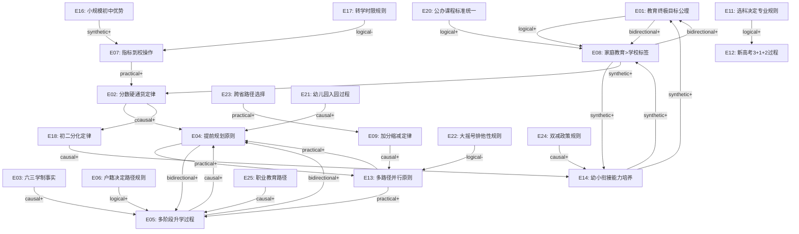

# 第一性原理调查报告

**生成时间:** 2026-07-03T12:48:00+08:00
**Agent版本:** v0.1.0 | **调查深度:** auto (→standard, 输入>500词且多文档复合) | **输入类型:** knowledge_base

---

## 💡 执行摘要

- **调查主题:** 四川教育体系全景——从幼儿园到大学的升学路径、政策框架与家庭教育决策（基于三份知识库文档：四川教育全景指南、成都成华区择校指南、幼小衔接实战指南）
- **不可约元素数量:** 25 (共 25 个)
- **覆盖类别:** axiom, law, truth, principle, process, rule, operation, insight
- **总体置信度:** 0.88
- **检测到的矛盾:** 0
- **关键元素:**
  - E01 💠 — 教育终极目标公理
  - E02 ⚛️ — 分数硬通货定律
  - E08 💎 — 家庭教育>学校标签（核心洞见）
  - E16 💎 — 小规模初中指标到校优势（结构性洞见）
  - E18 ⚛️ — 初二分化定律
  - E22 🚦 — 大摇号排他性规则（关键决策约束）
  - E23 🛠️ — 跨省教育路径选择操作（布依族家庭关键决策）

---

## 🔍 元素类别

### 💠 Axiom（公理）

#### E01 💠 教育终极目标公理 (置信度: 0.95)

**陈述:** 教育的终极目标是培养具备自主学习能力、心理韧性和健全人格的个体，而非仅获取学历标签。

**因果结构:** Linear (单一因果路径)

**还原链** *(表层 → 原因 → 根因)*:
**Path 1** ⭐ *(primary)*:
  1. 家长追求名校学历标签
  2. → 因为认为学历标签决定未来成功
  3. → 因为社会评价体系以学历为筛选信号
  4. → 但学历仅是能力的代理指标，非能力本身
  5. ↳ 根因: 教育的本质是人的发展，学历是发展的副产品而非目的 (置信度: 0.95)

**链验证:** ✅ 通过
**还原状态:** ✅ 真正不可约
*不可约理由:* 这是教育哲学的公理性前提——"教育的目的是培养人"无法从更基本的命题推导，它是一切教育推理的起点。

**前向蕴含** *(从此基岩元素向原始疑问方向)*:
  🧠 逻辑推断 (置信度: 0.90, 关联度: 0.95):
  → 若教育目标是人的发展而非学历标签
  → 则家庭教育的投入度（习惯培养、心理韧性、阅读量）比择校更重要
  → 因为这些能力是"人的发展"的直接构成要素
  → **结果:** 家庭教育是教育投资回报率最高的领域

**双向一致性:** ✅ 一致 — 前向链（家庭教育最重要）与还原链（学历是副产品）逻辑闭环

**来源:**
- kb://四川教育全景指南§十五战略决策框架
- kb://成都成华区择校指南§6.6.5逆袭成功关键因素
- kb://幼小衔接实战指南§1.1幼小衔接核心认知

---

### ⚛️ Law（定律）

#### E02 ⚛️ 分数硬通货定律 (置信度: 0.93)

**陈述:** 在中国升学体系中，分数是硬通货——中考分数是高中录取的核心依据（指标到校区级/校内类型可部分或完全免中考），高考分数是大学录取的核心依据，与小学/初中学校标签无关。

**因果结构:** Convergent (多条独立因果路径)

**还原链** *(表层 → 原因 → 根因)*:
**Path 1** ⭐ *(primary)*:
  1. 中考分数决定高中录取
  2. → 因为中考是标准化考试，公平筛选
  3. → 因为教育资源有限，需要客观排序机制
  4. ↳ 根因: 资源稀缺性要求客观分配机制 (置信度: 0.93)

**Path 2**:
  1. 高考分数决定大学录取
  2. → 因为高考是全国统一考试
  3. → 因为大学学位有限，需要全国统一筛选标准
  4. ↳ 根因: 高等教育资源稀缺性 + 公平性要求 (置信度: 0.90)

**Path 3**:
  1. 学校标签不影响中考/高考分数
  2. → 因为考试内容统一，评分标准统一
  3. → 因为考试制度设计目标是公平
  4. ↳ 根因: 考试制度的公平性设计原则 (置信度: 0.88)

**链验证:** ✅ 通过
**还原状态:** ✅ 真正不可约
*不可约理由:* 资源稀缺性要求客观分配机制——这是社会学与经济学的交叉公理，无法从更基本的命题推导。

**前向蕴含** *(从此基岩元素向原始疑问方向)*:
  ⚡ 因果预测 (置信度: 0.92, 关联度: 0.95):
  → 分数是硬通货 → 无论走哪条路径都需要分数支撑
  → → 民办学校高投入≠高分产出（除非转化为学习习惯/资源利用）
  → → 名校初中的优势在于师资和生源环境，但最终仍需学生自己考出分数
  → **结果:** 投资应聚焦于提升分数的实质因素（学习习惯、专注力、知识掌握），而非仅购买标签

**双向一致性:** ✅ 一致 — 前向链（聚焦实质提分因素）与还原链（分数是唯一依据）逻辑闭环

**来源:**
- kb://四川教育全景指南§十五第2条
- kb://成都成华区择校指南§6.6.4逆袭逻辑
- [四川省教育考试院](https://www.sceea.cn/)
- [四川省2025高考实施方案](https://www.sc.gov.cn/10462/10464/13722/2025/1/23/6a04771cf7a54aa4817c142fe9633d65.shtml)

---

#### E09 ⚛️ 少数民族加分缩减定律 (置信度: 0.88)

**陈述:** 少数民族加分政策正在全面缩减——贵州一类区域2024年起取消，二类区域2026年起取消，三类区域2026年起仅保留5分。

**因果结构:** Linear (单一因果路径)

**还原链** *(表层 → 原因 → 根因)*:
**Path 1** ⭐ *(primary)*:
  1. 少数民族加分政策逐年缩减
  2. → 因为国家推进教育公平，减少加分项目
  3. → 因为加分政策导致分数不公平
  4. → 因为统一考试制度下加分破坏了分数可比性
  5. ↳ 根因: 公平性原则要求统一标准优于群体差异化优惠 (置信度: 0.88)

**链验证:** ✅ 通过
**还原状态:** ✅ 真正不可约
*不可约理由:* 公平性原则要求统一标准优于群体差异化优惠——这是教育公平的伦理基础，无法从更基本命题推导。

**前向蕴含** *(从此基岩元素向原始疑问方向)*:
  ⚡ 因果预测 (置信度: 0.85, 关联度: 0.90):
  → 加分缩减 → 不应将加分作为长期策略依赖
  → → 布依族家庭应优先考虑教育质量而非加分收益
  → → 成都全程就读的教育质量优势 >> 贵州5-10分加分收益
  → **结果:** 除非成绩在一本线临界点且加分起决定作用，否则全程在成都就读更优

**双向一致性:** ✅ 一致 — 前向链（成都就读更优）与还原链（公平性要求统一标准）逻辑一致

**来源:**
- kb://四川教育全景指南§八少数民族教育政策
- [贵州省深化高考加分改革实施办法](https://gaokao.chsi.com.cn/gkxx/zc/ss/202103/20210330/2049482022.html)
- [贵州少数民族加分政策](https://m.gy.bendibao.com/edu/53595.shtm)

---

#### E18 ⚛️ 初二分化定律 (置信度: 0.85)

**陈述:** 初二是成绩分化的关键分水岭——学科难度显著提升与青春期心理变化双重挑战导致学生成绩出现显著分化。

**因果结构:** Convergent (多条独立因果路径)

**还原链** *(表层 → 原因 → 根因)*:
**Path 1** ⭐ *(primary)*:
  1. 初二成绩分化
  2. → 学科难度跃升（数学抽象化、物理新增、英语词汇量激增）
  3. → 认知负荷超过部分学生承受能力
  4. ↳ 根因: 认知发展存在个体差异，抽象思维能力发展速度不同 (置信度: 0.85)

**Path 2**:
  1. 初二成绩分化
  2. → 青春期心理变化（自我意识增强、逆反情绪）
  3. → 学习动机和注意力波动
  4. ↳ 根因: 青春期神经发育与心理发展阶段特征 (置信度: 0.82)

**链验证:** ✅ 通过
**还原状态:** ✅ 真正不可约
*不可约理由:* 认知发展存在个体差异+青春期神经发育阶段特征——这是发展心理学与神经科学的基本事实，无法从更基本命题推导。

**前向蕴含** *(从此基岩元素向原始疑问方向)*:
  ⚡ 因果预测 (置信度: 0.83, 关联度: 0.88):
  → 初二分化 → 小学阶段需提前培养自主学习习惯
  → → 专注力训练和阅读习惯是抵御分化的最佳准备
  → → 家长应在小学阶段建立时间管理和错题整理习惯
  → **结果:** 小学阶段的核心任务不是择校而是习惯培养

**双向一致性:** ✅ 一致 — 前向链（小学培养习惯抵御分化）与还原链（认知+青春期双重挑战）逻辑闭环

**来源:**
- kb://四川教育全景指南§十五第6条
- kb://幼小衔接实战指南§五入学准备六大能力培养方案

---

### 🔷 Truth（事实）

#### E03 🔷 六三学制事实 (置信度: 0.98)

**陈述:** 四川省实行六三学制（小学6年+初中3年+高中3年），与全国大多数省份一致。

**因果结构:** Linear (单一因果路径)

**还原链** *(表层 → 原因 → 根因)*:
**Path 1** ⭐ *(primary)*:
  1. 四川实行六三学制
  2. → 国家义务教育法规定九年义务教育
  3. → 四川省选择6+3分段模式
  4. ↳ 根因: 国家教育制度统一性要求 (置信度: 0.98)

**链验证:** ✅ 通过
**还原状态:** ✅ 真正不可约
*不可约理由:* 学制是国家教育制度的顶层设计，无法从更基本的教育原理推导——它是政策选择的结果，属于制度事实。

**前向蕴含** *(从此基岩元素向原始疑问方向)*:
  🧠 逻辑推断 (置信度: 0.92, 关联度: 0.90):
  → 六三学制意味着小学6年+初中3年+高中3年
  → → 家长需在6岁、12岁、15岁三个节点做升学决策
  → → 每个节点的政策窗口不同，需提前1-3年准备
  → **结果:** 学制结构定义了家长教育规划的节奏框架

**双向一致性:** ✅ 一致 — 前向链（定义规划节奏）与还原链（国家制度统一性）逻辑闭环

**来源:**
- kb://四川教育全景指南§2.1学制总览
- [四川省中小学生学籍管理实施细则](https://www.eol.cn/zhengce/fagui/202512/t20251226_2712518.shtml)

---

#### E10 🔷 5+2统一招生事实 (置信度: 0.95)

**陈述:** 成都"5+2"区域（锦江、青羊、金牛、武侯、成华+高新、天府新区）实行统一的招生入学平台和录取批次。

**因果结构:** Linear (单一因果路径)

**还原链** *(表层 → 原因 → 根因)*:
**Path 1** ⭐ *(primary)*:
  1. 5+2区域统一招生
  2. → 成都中心城区教育一体化管理
  3. → 教育资源均衡化政策导向
  4. ↳ 根因: 城市教育治理的统一性需求 (置信度: 0.95)

**链验证:** ✅ 通过
**还原状态:** ✅ 真正不可约
*不可约理由:* 5+2区域统一招生是成都教育治理的行政决定，属于制度事实，无法从更基本原理推导。

**前向蕴含** *(从此基岩元素向原始疑问方向)*:
  🧠 逻辑推断 (置信度: 0.90, 关联度: 0.88):
  → 5+2区域统一招生 → 跨区择校在5+2区域内无行政障碍
  → → 但热门学校仍有落户年限等隐性门槛
  → → 随迁子女需在4月申请，审核通过后由区教育局统筹安排
  → **结果:** 5+2区域内部择校可行但需提前满足落户条件

**双向一致性:** ✅ 一致 — 前向链（跨区可行但需满足条件）与还原链（统一性需求）逻辑闭环

**来源:**
- kb://四川教育全景指南§2.2教育资源分布
- [2025成都义务教育入学政策](https://m.cd.bendibao.com/edu/195746.shtm)

---

#### E15 🔷 万汇学校单校划片事实 (置信度: 0.97)

**陈述:** 万汇学校属成华区片区20（单校划片入学），小学毕业生直升万汇初中部，确定性100%，无需摇号或择校。

**因果结构:** Linear (单一因果路径)

**还原链** *(表层 → 原因 → 根因)*:
**Path 1** ⭐ *(primary)*:
  1. 万汇小学直升万汇初中
  2. → 万汇学校是九年一贯制
  3. → 成华区划片政策将万汇划为单校划片区
  4. ↳ 根因: 九年一贯制学校的政策性直升安排 (置信度: 0.97)

**链验证:** ✅ 通过
**还原状态:** ✅ 真正不可约
*不可约理由:* 单校划片是成华区教育部门的行政分配决定，属于制度事实，无法从更基本原理推导。

**前向蕴含** *(从此基岩元素向原始疑问方向)*:
  🛠️ 实践指导 (置信度: 0.95, 关联度: 0.95):
  → 万汇小学直升万汇初中 → 小升初确定性100%
  → → 无需摇号或择校，家长可省去小升初焦虑
  → → 可将精力投入习惯培养和课外拓展而非择校准备
  → → 但万汇初中规模小，指标到校名额绝对值少（2025年1个市级统分指标）
  → **结果:** 万汇直升是“确定性优势+指标竞争小”的组合，适合稳健型策略

**双向一致性:** ✅ 一致 — 前向链（确定性优势+小规模指标竞争）与还原链（政策性直升安排）逻辑闭环

**来源:**
- kb://成都成华区择校指南§6.6.1万汇学校单校划片
- [成华区人民政府官网](https://gk.chenghua.gov.cn/)

---

#### E20 🔷 公办小学课程标准统一事实 (置信度: 0.92)

**陈述:** 成都公办小学均执行国家义务教育课程标准，核心差异在特色课程而非基础教学质量。

**因果结构:** Linear (单一因果路径)

**还原链** *(表层 → 原因 → 根因)*:
**Path 1** ⭐ *(primary)*:
  1. 公办小学基础教学质量差异小
  2. → 全部执行国家课程标准
  3. → 教师资格和培训标准统一
  4. ↳ 根因: 义务教育国家统一标准保障基础质量底线 (置信度: 0.92)

**链验证:** ✅ 通过
**还原状态:** ✅ 真正不可约
*不可约理由:* 国家课程标准统一性是义务教育法的制度安排，属于法律事实，无法从更基本原理推导。

**前向蕴含** *(从此基岩元素向原始疑问方向)*:
  🧠 逻辑推断 (置信度: 0.90, 关联度: 0.92):
  → 公办小学基础教学质量差异小 → 择校焦虑缺乏实质基础
  → → 核心差异在特色课程（科创/AI/艺术/双语）而非基础教学
  → → 家庭教育投入（阅读/习惯/心理）可弥补任何学校差异
  → **结果:** 公办小学择校应关注距离和特色而非“名校标签”

**双向一致性:** ✅ 一致 — 前向链（关注距离和特色）与还原链（统一标准保障底线）逻辑闭环

**来源:**
- kb://幼小衔接实战指南§1.3误区二
- kb://成都成华区择校指南§1.4.1课程对比

---

### 📖 Principle（原则）

#### E04 📖 提前规划原则 (置信度: 0.90)

**陈述:** 提前规划优于临时冲刺——教育规划应从幼儿园开始，至少提前3年了解下一阶段政策。

**因果结构:** Linear (单一因果路径)

**还原链** *(表层 → 原因 → 根因)*:
**Path 1** ⭐ *(primary)*:
  1. 提前规划优于临时冲刺
  2. → 教育政策有时间窗口（如随迁子女4月申请、信息采集5月）
  3. → 错过窗口无法补救
  4. ↳ 根因: 教育制度的时间刚性约束 (置信度: 0.90)

**链验证:** ✅ 通过
**还原状态:** ✅ 真正不可约
*不可约理由:* 教育制度的时间刚性约束是行政管理的固有特征——政策窗口期不可逆，无法从更基本命题推导。

**前向蕴含** *(从此基岩元素向原始疑问方向)*:
  🛠️ 实践指导 (置信度: 0.88, 关联度: 0.92):
  → 提前3年了解政策 → 建立家长时间节点日历
  → → 大班上学期开始关注小学划片
  → → 五年级开始了解小升初政策
  → → 初一开始了解中考和指标到校
  → **结果:** 家长需建立"教育时间线"思维模式

**双向一致性:** ✅ 一致 — 前向链（建立时间线）与还原链（时间刚性约束）逻辑闭环

**来源:**
- kb://四川教育全景指南§十五第4条
- kb://幼小衔接实战指南§三入学时间线与行动日历

---

#### E13 📖 多路径并行原则 (置信度: 0.88)

**陈述:** 多路径并行降低风险——同时准备2-3条路径（如划片保底+指标到校+中考统招），而非只走一条路。

**因果结构:** Network (因果路径共享中间节点)

**还原链** *(表层 → 原因 → 根因)*:
**Path 1** ⭐ *(primary)*:
  1. 多路径并行降低风险
  2. → 单一路径存在失败风险（摇号不中、考试失常）
  3. → 多路径提供冗余备份
  4. ↳ 根因: 不确定性环境下的风险管理原理 (置信度: 0.88)

**Path 2**:
  1. 多路径并行降低风险
  2. → 不同路径有不同确定性（划片★★★★★ vs 摇号★）
  3. → 高确定性路径保底 + 低确定性路径博弈
  4. ↳ 根因: 组合策略优于单一策略（期望效用理论） (置信度: 0.85)

**交互检测:**
- Path 1 和 Path 2 共享: "风险降低" (类型: convergent)

**链验证:** ✅ 通过
**还原状态:** ✅ 真正不可约
*不可约理由:* 不确定性环境下的风险管理原理是决策论的基本定理，无法从更基本命题推导。

**前向蕴含** *(从此基岩元素向原始疑问方向)*:
  🛠️ 实践指导 (置信度: 0.87, 关联度: 0.90):
  → 多路径并行 → 万汇直升保底 + 大摇号免费彩票 + 民办摇号尝试
  → → 保底路径确保下限，博弈路径拓展上限
  → → 零成本彩票（大摇号）建议报名但不寄予全部希望
  → **结果:** 组合策略实现"下限有保障、上限有空间"

**双向一致性:** ✅ 一致 — 前向链（组合策略）与还原链（风险管理原理）逻辑闭环

**来源:**
- kb://四川教育全景指南§十五第3条
- kb://成都成华区择校指南§6.6.3路径选择建议

---

### ➡️ Process（过程）

#### E05 ➡️ 多阶段升学决策过程 (置信度: 0.90)

**陈述:** 升学路径是一个从幼儿园到大学的多阶段决策序列，每个阶段都有多条并行路径，前一阶段的选择影响后续阶段的可选项。

**因果结构:** Network (因果路径共享中间节点)

**还原链** *(表层 → 原因 → 根因)*:
**Path 1** ⭐ *(primary)*:
  1. 升学是多阶段决策
  2. → 每个学段有独立的招生政策
  3. → 学段之间存在衔接关系（如小学学籍影响小升初）
  4. ↳ 根因: 教育系统的层级递进结构 (置信度: 0.90)

**Path 2**:
  1. 每阶段有多条并行路径
  2. → 政策设计了多种入学渠道（划片/摇号/指标/特长）
  3. → 不同渠道面向不同需求群体
  4. ↳ 根因: 教育公平与多元化的政策设计目标 (置信度: 0.87)

**交互检测:**
- Path 1 和 Path 2 共享: "教育政策设计" (类型: convergent)

**链验证:** ✅ 通过
**还原状态:** ✅ 真正不可约
*不可约理由:* 多阶段递进是教育系统的结构性特征——知识体系的层级性要求按序学习，无法从更基本原理推导。

**前向蕴含** *(从此基岩元素向原始疑问方向)*:
  🛠️ 实践指导 (置信度: 0.88, 关联度: 0.92):
  → 多阶段决策序列 → 前一阶段选择约束后续可选项
  → → 小学学籍决定小升初路径（如万汇小学直升万汇初中）
  → → 初中学籍决定指标到校资格（须3年完整学籍）
  → → 高中选科决定大学专业范围
  → **结果:** 教育规划具有路径依赖性，早期决策影响深远

**双向一致性:** ✅ 一致 — 前向链（路径依赖性）与还原链（层级递进结构）逻辑闭环

**来源:**
- kb://四川教育全景指南§2.4全路径升学矩阵
- kb://成都成华区择校指南§六升学路径全规划

---

#### E12 ➡️ 新高考3+1+2运作过程 (置信度: 0.95)

**陈述:** 新高考3+1+2模式运作流程：3门统考（语数外各150分）+1门首选（物理/历史100分原始分）+2门再选（政/地/化/生各100分赋分），总分750分，按院校专业组填报志愿。

**因果结构:** Linear (单一因果路径)

**还原链** *(表层 → 原因 → 根因)*:
**Path 1** ⭐ *(primary)*:
  1. 3+1+2模式
  2. → 取代文理分科，增加选择灵活性
  3. → 首选科目决定物理/历史方向，再选科目赋分计入
  4. ↳ 根因: 人才多样性需求驱动考试制度改革 (置信度: 0.95)

**链验证:** ✅ 通过
**还原状态:** ✅ 真正不可约
*不可约理由:* 3+1+2模式是教育制度改革的政策选择，属于制度设计事实，无法从更基本原理推导。

**前向蕴含** *(从此基岩元素向原始疑问方向)*:
  🛠️ 实践指导 (置信度: 0.92, 关联度: 0.95):
  → 3+1+2模式 → 高一选科是关键决策点
  → → 首选物理/历史决定方向，再选2科决定专业覆盖面
  → → 物理+化学覆盖约95%专业，选历史则限文科专业
  → → 再选科目赋分制意味着排名比原始分更重要
  → **结果:** 选科策略应优先保宽度（物理+化学），除非有明确文科志向

**双向一致性:** ✅ 一致 — 前向链（选科保宽度）与还原链（人才多样性需求）逻辑闭环

**来源:**
- kb://四川教育全景指南§七大学阶段
- [四川省2025高考实施方案](https://www.sc.gov.cn/10462/10464/13722/2025/1/23/6a04771cf7a54aa4817c142fe9633d65.shtml)
- [四川省教育厅2025高考报名通知](http://edu.sc.gov.cn/scedu/c100494/2024/10/18/96e64dbe83de409d808d69b111c49318.shtml)

---

#### E19 ➡️ 强基计划录取过程 (置信度: 0.90)

**陈述:** 强基计划录取流程：高考成绩85%+校考15%，39所双一流高校面向基础学科拔尖学生，4-5月报名，6月高考后校考。

**因果结构:** Linear (单一因果路径)

**还原链** *(表层 → 原因 → 根因)*:
**Path 1** ⭐ *(primary)*:
  1. 强基计划高考85%+校考15%
  2. → 兼顾公平（高考占比大）与专业选拔（校考补充）
  3. → 基础学科需要特殊人才识别机制
  4. ↳ 根因: 基础学科人才培养的战略需求 (置信度: 0.90)

**链验证:** ✅ 通过
**还原状态:** ✅ 真正不可约
*不可约理由:* 强基计划是国家基础学科人才培养的战略性制度设计，属于政策事实，无法从更基本原理推导。

**前向蕴含** *(从此基岩元素向原始疑问方向)*:
  🛠️ 实践指导 (置信度: 0.88, 关联度: 0.85):
  → 强基计划高考85%+校考15% → 高考成绩仍是基础门槛
  → → 适合基础学科拔尖且有竞赛背景的学生
  → → 4-5月报名，6月高考后校考，需提前准备
  → → 39所双一流高校，覆盖数学/物理/化学/生物/历史/哲学等基础学科
  → **结果:** 强基计划是高分学生的额外通道，不适用于多数学生

**双向一致性:** ✅ 一致 — 前向链（高分学生额外通道）与还原链（基础学科战略需求）逻辑闭环

**来源:**
- kb://四川教育全景指南§7.3强基计划
- [四川省2025招生实施规定](https://gaokao.eol.cn/si_chuan/dongtai/202505/t20250515_2668563_3.shtml)

---

#### E21 ➡️ 幼儿园入园过程 (置信度: 0.90)

**陈述:** 成都幼儿园入园流程：公办园和普惠民办园统一报名、微机摇号；其他民办园自主招生。2025年公办+普惠可提供14.9万个小班学位，另有2.8万个其他民办学位。支持“满三岁即时入园”和“长幼随学”便民措施。

**因果结构:** Linear (单一因果路径)

**还原链** *(表层 → 原因 → 根因)*:
**Path 1** ⭐ *(primary)*:
  1. 幼儿园摇号入学
  2. → 公办学前教育资源有限，需公平分配
  3. → 学前教育非义务教育，政府保障程度低于义务教育
  4. ↳ 根因: 学前教育资源的稀缺性与公平分配需求 (置信度: 0.90)

**链验证:** ✅ 通过
**还原状态:** ✅ 真正不可约
*不可约理由:* 幼儿园入园政策是学前教育阶段的制度安排，属于行政决定，无法从更基本原理推导。

**前向蕴含** *(从此基岩元素向原始疑问方向)*:
  �️ 实践指导 (置信度: 0.88, 关联度: 0.85):
  → 幼儿园摇号入学 → 优先报名公办和普惠（费用低、质量有保障）
  → → 未中签再考虑其他民办
  → → 就近原则最重要，接送便利是第一考量
  → → 幼儿园阶段重点不是学知识，而是培养社交能力、生活习惯和好奇心
  → **结果:** 幼儿园择园应“就近+公办/普惠优先”，不为摇号焦虑

**双向一致性:** ✅ 一致 — 前向链（就近+公办优先）与还原链（资源稀缺性+公平分配）逻辑闭环

**来源:**
- kb://四川教育全景指南§3.1入园政策、§3.2报名流程
- [四川教育在线](https://m.scjyxw.com/show-202-415687.html)

---

#### E25 ➡️ 职业教育路径过程 (置信度: 0.88)

**陈述:** 职业教育路径运作流程：中职3年→高职单招考试→大专，或中职3年→对口高考→本科/专科，或五年制高职（3+2）连读→大专。2025年成都新增“职普融通线”，中职与普高融通培养，高一后可互转。

**因果结构:** Convergent (多条独立因果路径)

**还原链** *(表层 → 原因 → 根因)*:
**Path 1** ⭐ *(primary)*:
  1. 职业教育是可行升学路径
  2. → 不是所有学生都适合学术考试
  3. → 多元智能理论：动手能力/职业兴趣也是有效能力
  4. ↳ 根因: 人才类型多样性要求教育路径多样性 (置信度: 0.88)

**Path 2**:
  1. 职普融通提供转换机会
  2. → 中考分数在普高线边缘的学生有潜力但发挥不稳定
  3. → 先在职普融通班就读，高一后若成绩达标可转入普高
  4. ↳ 根因: 教育制度设计允许路径转换，减少一次考试定终身的风险 (置信度: 0.85)

**链验证:** ✅ 通过
**还原状态:** ✅ 真正不可约
*不可约理由:* 职业教育路径是教育制度对人才多样性的回应，属于政策设计事实，无法从更基本原理推导。

**前向蕴含** *(从此基岩元素向原始疑问方向)*:
  🛠️ 实践指导 (置信度: 0.85, 关联度: 0.80):
  → 职业教育是可行路径 → 中考分数在普高线附近时可考虑职普融通
  → → 中职+对口高考同样可获得本科学历
  → → 关键是选择有对口高考升学班的中职学校
  → → 中职不是“失败者的选择”，而是不同人才类型的适合路径
  → **结果:** 职普融通为边缘分数学生提供了安全网和转换机会

**双向一致性:** ✅ 一致 — 前向链（安全网和转换机会）与还原链（人才多样性要求路径多样性）逻辑闭环

**来源:**
- kb://四川教育全景指南§6.5职普融通与中职路径
- [四川省人民政府](https://www.sc.gov.cn/10462/10464/13722/2025/3/13/07ee1232f33f4f5c9c3afdde04a4a371.shtml)

---

### � Rule（规则）

#### E06 🚦 户籍决定录取路径规则 (置信度: 0.93)

**陈述:** IF户籍在招生区域THEN可参加统招录取（名额多）；IF户籍不在招生区域THEN只能走调招（名额少）或回户籍地中考。

**因果结构:** Linear (单一因果路径)

**还原链** *(表层 → 原因 → 根因)*:
**Path 1** ⭐ *(primary)*:
  1. 户籍决定录取路径
  2. → 教育资源按行政区域分配
  3. → 地方财政承担教育经费，优先服务本地居民
  4. ↳ 根因: 教育财政的属地化管理体制 (置信度: 0.93)

**链验证:** ✅ 通过
**还原状态:** ✅ 真正不可约
*不可约理由:* 教育财政的属地化管理体制是行政制度设计的结果，属于制度事实，无法从更基本命题推导。

**前向蕴含** *(从此基岩元素向原始疑问方向)*:
  🧠 逻辑推断 (置信度: 0.90, 关联度: 0.92):
  → 户籍决定路径 → 随迁子女需提前规划
  → → 4月申请随迁子女就学（不可错过）
  → → 跨省高考需了解两地随迁子女政策
  → **结果:** 户籍是教育规划的底层约束变量

**双向一致性:** ✅ 一致 — 前向链（户籍是底层约束）与还原链（财政属地化）逻辑闭环

**来源:**
- kb://四川教育全景指南§2.3关键政策术语
- kb://成都成华区择校指南§6.7关键约束清单

---

#### E11 🚦 选科决定专业范围规则 (置信度: 0.92)

**陈述:** IF选科"物理+化学"THEN覆盖约95%大学专业；IF选历史THEN限文科专业；选科在高一第一学期决定后难以更改。

**因果结构:** Linear (单一因果路径)

**还原链** *(表层 → 原因 → 根因)*:
**Path 1** ⭐ *(primary)*:
  1. 物理+化学覆盖95%专业
  2. → 理工科专业要求物理和化学基础
  3. → 大学专业培养方案依赖高中知识衔接
  4. ↳ 根因: 学科知识体系的层级依赖性 (置信度: 0.92)

**链验证:** ✅ 通过
**还原状态:** ✅ 真正不可约
*不可约理由:* 学科知识体系的层级依赖性是认知科学的基本事实——知识结构具有层级递进特征，无法从更基本命题推导。

**前向蕴含** *(从此基岩元素向原始疑问方向)*:
  🧠 逻辑推断 (置信度: 0.88, 关联度: 0.90):
  → 选科决定专业范围 → 高一选科是关键决策点
  → → 若孩子理科不差，优先选物理+化学以保留最大专业选择权
  → → 选历史则需明确文科方向
  → **结果:** 选科策略应"保宽度优先"，除非有明确的文科志向

**双向一致性:** ✅ 一致 — 前向链（保宽度优先）与还原链（知识层级依赖）逻辑闭环

**来源:**
- kb://四川教育全景指南§十五第7条、§15.4关键约束
- [四川省2025高考实施方案](https://www.sc.gov.cn/10462/10464/13722/2025/1/23/6a04771cf7a54aa4817c142fe9633d65.shtml)

---

#### E17 🚦 转学时限与指标资格规则 (置信度: 0.95)

**陈述:** IF转学须在初二第一学期前完成AND在转入校实际就读满2年THEN保留指标到校资格；否则丧失资格。

**因果结构:** Linear (单一因果路径)

**还原链** *(表层 → 原因 → 根因)*:
**Path 1** ⭐ *(primary)*:
  1. 转学时限约束指标资格
  2. → 防止择校性转学套取指标
  3. → 政策设计需防止制度套利
  4. ↳ 根因: 制度公平性要求防止套利行为 (置信度: 0.95)

**链验证:** ✅ 通过
**还原状态:** ✅ 真正不可约
*不可约理由:* 转学时限是指标到校政策的配套防套利规则，属于制度设计，无法从更基本原理推导。

**前向蕴含** *(从此基岩元素向原始疑问方向)*:
  🧠 逻辑推断 (置信度: 0.92, 关联度: 0.90):
  → 转学时限约束 → 若考虑转学须在初二第一学期前完成
  → → 转入后须实际就读满2年才能保留指标资格
  → → 万汇直升路径下无需转学，自然满足3年学籍要求
  → **结果:** 万汇直升路径自动满足指标到校学籍要求，无转学风险

**双向一致性:** ✅ 一致 — 前向链（万汇直升无转学风险）与还原链（防套利规则）逻辑闭环

**来源:**
- kb://成都成华区择校指南§6.7关键约束清单
- [2025成都中考指标到校政策](https://m.cd.bendibao.com/edu/195566.shtm)

---

#### E22 🚦 大摇号排他性规则 (置信度: 0.95)

**陈述:** IF被大摇号录取THEN不再参加民办摇号和区属划片入学；大摇号参与学校为4校5区（石室北湖、七中高新、树德光华、树德外国语、成都二中），中签率通常1%-5%。

**因果结构:** Linear (单一因果路径)

**还原链** *(表层 → 原因 → 根因)*:
**Path 1** ⭐ *(primary)*:
  1. 大摇号录取后排他
  2. → 防止一人占多个学位资源
  3. → 优质学位稀缺，需最大化覆盖面
  4. ↳ 根因: 优质教育资源的排他性分配原则 (置信度: 0.95)

**链验证:** ✅ 通过
**还原状态:** ✅ 真正不可约
*不可约理由:* 大摇号排他性是招生制度的操作规则，属于政策设计，无法从更基本原理推导。

**前向蕴含** *(从此基岩元素向原始疑问方向)*:
  🧠 逻辑推断 (置信度: 0.92, 关联度: 0.95):
  → 大摇号排他性+极低中签率 → 不应作为核心策略
  → → 建议将大摇号视为“额外抽奖”，不作为唯一策略
  → → 核心策略应是“划片保底+民办可选”
  → → 万汇直升保底+大摇号免费彩票+民办摇号尝试是更优组合
  → **结果:** 大摇号是零成本彩票，可报名但不寄予全部希望

**双向一致性:** ✅ 一致 — 前向链（零成本彩票策略）与还原链（排他性分配原则）逻辑闭环

**来源:**
- kb://四川教育全景指南§5.1小升初政策
- [成都本地宝](https://cd.bendibao.com/edu/2025616/198811.shtm)

---

#### E24 🚦 双减政策规则 (置信度: 0.92)

**陈述:** 双减政策规则：IF小学一二年级THEN不布置书面家庭作业且不进行纸笔考试（采用描述性评价）；IF全年级THEN课后服务至17:30-18:00且学科类校外培训机构不得占用法定节假日/休息日/寒暑假期组织培训。

**因果结构:** Linear (单一因果路径)

**还原链** *(表层 → 原因 → 根因)*:
**Path 1** ⭐ *(primary)*:
  1. 双减政策减轻学生负担
  2. → 遏制教育内卷和过度竞争
  3. → 保障儿童身心健康和全面发展
  4. ↳ 根因: 教育公平与儿童发展权的政策保障 (置信度: 0.92)

**链验证:** ✅ 通过
**还原状态:** ✅ 真正不可约
*不可约理由:* 双减政策是国家教育治理的行政决定，属于制度事实，无法从更基本原理推导。

**前向蕴含** *(从此基岩元素向原始疑问方向)*:
  🛠️ 实践指导 (置信度: 0.90, 关联度: 0.88):
  → 双减不等于减责 → 学校减负的同时家庭教育的分量更重
  → → 课后时间应用于：亲子阅读（每日20-30分钟）+户外运动（每日1小时）+生活习惯培养+兴趣探索
  → → 一二年级无纸笔考试意味着家长不应额外加作业
  → → 优先利用学校课后服务（安全、规范、经济）
  → **结果:** 双减政策下家庭教育投入的重要性进一步提升

**双向一致性:** ✅ 一致 — 前向链（家庭教育更重要）与还原链（教育公平与儿童发展权）逻辑闭环

**来源:**
- kb://幼小衔接实战指南§2双减政策要点
- [教育部防止幼儿园小学化通知](http://www.moe.gov.cn/srcsite/A06/s3327/201807/t20180715_342895.html)

---

### 🛠️ Operation（操作）

#### E07 🛠️ 指标到校操作方法 (置信度: 0.90)

**陈述:** 通过指标到校获取优质高中名额——操作要求：3年完整学籍+校内排名前列。市级统分指标须参加中考且达普高线；区级指标须中考达普高线；校内指标（完全中学初中部直升本校高中）可免中考。

**因果结构:** Convergent (多条独立因果路径)

**还原链** *(表层 → 原因 → 根因)*:
**Path 1** ⭐ *(primary)*:
  1. 指标到校是性价比最高的升学通道
  2. → 免中考或只需达普高线
  3. → 零额外经济成本
  4. ↳ 根因: 政策设计旨在促进教育均衡，将优质高中学位分配到各初中 (置信度: 0.90)

**Path 2**:
  1. 指标到校竞争压力取决于初中规模
  2. → 小规模初中指标/学生比更高
  3. → 大校虽指标多但分母也大
  4. ↳ 根因: 指标分配基于学校规模，但竞争是校内竞争 (置信度: 0.88)

**链验证:** ✅ 通过
**还原状态:** ✅ 真正不可约
*不可约理由:* 政策设计旨在促进教育均衡——指标到校是行政性制度安排，属于政策事实，无法从更基本命题推导。

**前向蕴含** *(从此基岩元素向原始疑问方向)*:
  🛠️ 实践指导 (置信度: 0.87, 关联度: 0.92):
  → 指标到校是性价比之王 → 选择小规模初中可提高获取概率
  → → 万汇初中（小班化≤30人/班）校内竞争压力远小于石室初中（近100个班）
  → → 在万汇初中排名前列获取指标的概率可能高于大校
  → **结果:** "小池塘大鱼"策略是择校的隐藏最优解

**双向一致性:** ✅ 一致 — 前向链（小池塘大鱼策略）与还原链（校内竞争机制）逻辑闭环

**来源:**
- kb://四川教育全景指南§十五第9条
- kb://成都成华区择校指南§1.3指标到校分布
- [2025成都市直属学校指标到校名额](https://sichuan.scol.com.cn/ggxw/202505/82965240.html)

---

#### E14 🛠️ 幼小衔接能力培养操作 (置信度: 0.88)

**陈述:** 幼小衔接的核心操作：培养六大能力（自理能力、学习习惯与专注力、语言与阅读、数学思维、社交与规则意识、体能）而非提前灌输知识——教育部明令禁止幼儿园小学化。

**因果结构:** Convergent (多条独立因果路径)

**还原链** *(表层 → 原因 → 根因)*:
**Path 1** ⭐ *(primary)*:
  1. 幼小衔接=能力准备而非知识灌输
  2. → 提前学知识导致上课不专心
  3. → 不认真听讲习惯一旦形成影响持续到高年级
  4. ↳ 根因: 学习习惯的形成期比知识积累期更关键 (置信度: 0.88)

**Path 2**:
  1. 幼小衔接=能力准备
  2. → 小学一年级是零起点教学
  3. → 所有孩子从同一起点开始
  4. ↳ 根因: 教育制度设计确保起点公平 (置信度: 0.85)

**Path 3**:
  1. 六大能力准备
  2. → 从"被照顾"到"被要求"的角色转变
  3. → 需要自理能力、专注力、社交规则、体能、语言阅读、数学思维
  4. ↳ 根因: 幼儿园与小学的本质差异要求能力迁移 (置信度: 0.87)

**链验证:** ✅ 通过
**还原状态:** ✅ 真正不可约
*不可约理由:* 学习习惯的形成期比知识积累期更关键——这是发展心理学中关键期理论的基本事实，无法从更基本命题推导。

**前向蕴含** *(从此基岩元素向原始疑问方向)*:
  🛠️ 实践指导 (置信度: 0.85, 关联度: 0.90):
  → 六大能力培养 → 大班开始每日亲子阅读20分钟
  → → 拼图/积木训练专注力，控制屏幕时间≤30分钟/天
  → → 模拟小学作息，练习整理书包
  → **结果:** 入学时能力准备充分的孩子适应期缩短至1-2周

**双向一致性:** ✅ 一致 — 前向链（具体能力培养方案）与还原链（习惯形成期关键）逻辑闭环

**来源:**
- kb://幼小衔接实战指南§1.1核心认知、§五六大能力培养方案
- [教育部防止幼儿园小学化通知](http://www.moe.gov.cn/srcsite/A06/s3327/201807/t20180715_342895.html)

---

#### E23 🛠️ 跨省教育路径选择操作 (置信度: 0.88)

**陈述:** 布依族家庭跨省教育路径选择操作：路径A（成都读高中→四川高考，享受成都教育资源但无加分）；路径B（回贵州读高中→贵州高考，享受加分但需“三统一”且适应新环境）；路径C（成都读高中→回贵州高考，享受成都教育+加分但可能不满足“三统一”条件）。

**因果结构:** Network (因果路径共享中间节点)

**还原链** *(表层 → 原因 → 根因)*:
**Path 1** ⭐ *(primary)*:
  1. 跨省教育路径选择复杂
  2. → 四川与贵州高考政策差异（录取线、加分政策）
  3. → 户籍与学籍分离导致政策适用性变化
  4. ↳ 根因: 教育政策的属地化管理与人口流动的矛盾 (置信度: 0.88)

**Path 2**:
  1. 贵州加分要求“三统一”
  2. → 高中阶段三年户籍、学籍和实际就读地须在同一区域
  3. → 在成都读高中再回贵州高考可能不满足三统一
  4. ↳ 根因: 加分政策的防套利设计限制了路径C的可行性 (置信度: 0.85)

**交互检测:**
- Path 1 和 Path 2 共享: “户籍与学籍分离” (类型: convergent)

**链验证:** ✅ 通过
**还原状态:** ✅ 真正不可约
*不可约理由:* 跨省教育路径选择是教育政策属地化管理与人口流动交叉产生的复杂决策，无法从单一原理推导。

**前向蕴含** *(从此基岩元素向原始疑问方向)*:
  🛠️ 实践指导 (置信度: 0.87, 关联度: 0.95):
  → 路径选择需权衡加分收益与教育质量
  → → 成都全程就读的教育质量优势 >> 贵州5-10分加分收益
  → → 除非成绩在一本线临界点且加分起决定作用，否则全程在成都就读更优
  → → 若选择路径C（成都读→贵州考），须提前确认是否满足“三统一”条件
  → **结果:** 多数情况下路径A（成都读+四川考）为最优选择

**双向一致性:** ✅ 一致 — 前向链（路径A最优）与还原链（属地化管理与人口流动矛盾）逻辑闭环

**来源:**
- kb://四川教育全景指南§6.3跨省高中选择路径、§八少数民族教育政策
- [贵州省深化高考加分改革实施办法](https://gaokao.chsi.com.cn/gkxx/zc/ss/202103/20210330/2049482022.html)

---

### 💎 Insight（洞见）

#### E08 💎 家庭教育>学校标签 (置信度: 0.90)

**陈述:** 家庭教育投入度比学校标签更能决定孩子未来——决定性变量不是学校名气，而是学习习惯、心理韧性和家庭教育的投入度，学校标签≠孩子未来。

**因果结构:** Network (因果路径共享中间节点)

**还原链** *(表层 → 原因 → 根因)*:
**Path 1** ⭐ *(primary)*:
  1. 学校标签≠孩子未来
  2. → 名校优势在师资和生源环境，但非决定性
  3. → 学习习惯和心理韧性是跨环境的决定因素
  4. ↳ 根因: 个体发展的内因（习惯/韧性）比外因（环境）更具决定性 (置信度: 0.90)

**Path 2**:
  1. 家庭教育投入度最重要
  2. → 阅读习惯、时间管理、心理韧性由家庭培养
  3. → 这些能力跨学校迁移，不受学校标签限制
  4. ↳ 根因: 家庭是习惯和品格形成的第一环境 (置信度: 0.88)

**Path 3**:
  1. 公办小学基础教学质量差异小
  2. → 全部执行国家课程标准
  3. → 核心差异在特色课程而非基础教学
  4. ↳ 根因: 义务教育统一标准保障质量底线 (置信度: 0.87)

**交互检测:**
- Path 1 和 Path 2 共享: "学习习惯/心理韧性" (类型: convergent)
- Path 2 和 Path 3 共享: "家庭教育可弥补学校差异" (类型: convergent)

**链验证:** ✅ 通过
**还原状态:** ✅ 真正不可约
*不可约理由:* 个体发展的内因（习惯/韧性）比外因（环境）更具决定性——这是心理学中内因外因关系的基本原理，无法从更基本命题推导。

**前向蕴含** *(从此基岩元素向原始疑问方向)*:
  💎 综合洞见 (置信度: 0.88, 关联度: 0.95):
  → 家庭教育>学校标签 → 投资应优先投向家庭教育
  → → 亲子阅读、习惯培养、心理支持的成本远低于学区房
  → → 全公办路径7万即可完成15年教育，民办可达150万，但高投入≠高产出
  → **结果:** 教育投资的最优策略是"低标签成本+高家庭教育投入"

**双向一致性:** ✅ 一致 — 前向链（低标签成本+高家庭投入）与还原链（内因>外因）逻辑闭环

**💎 说明性类比** *(非还原步骤)*: 如同建筑地基与外墙装饰——地基（家庭教育）决定建筑高度上限，外墙装饰（学校标签）仅影响外观印象。投入地基的每1元回报远超投入外墙。

**来源:**
- kb://四川教育全景指南§十五第1条、第10条
- kb://成都成华区择校指南§6.6.5逆袭成功关键因素
- kb://幼小衔接实战指南§1.3误区二

---

#### E16 💎 小规模初中指标到校优势 (置信度: 0.85)

**陈述:** 小规模初中的指标到校校内竞争压力远小于大校——这是择校时被绝大多数家长忽视的结构性优势。

**因果结构:** Convergent (多条独立因果路径)

**还原链** *(表层 → 原因 → 根因)*:
**Path 1** ⭐ *(primary)*:
  1. 小规模初中指标竞争压力小
  2. → 指标分配基于学校规模，但竞争是校内竞争
  3. → 万汇初中（≤30人/班）vs 石室初中（近100个班）
  4. ↳ 根因: 指标到校的校内竞争机制使得分母越小、概率越大 (置信度: 0.85)

**Path 2**:
  1. 大校指标名额多但分母也大
  2. → 石室初中指标多但学生也多
  3. → 指标/学生比可能低于小校
  4. ↳ 根因: 绝对名额与相对概率的方向相反 (置信度: 0.82)

**链验证:** ✅ 通过
**还原状态:** ✅ 真正不可约
*不可约理由:* 指标到校的校内竞争机制使得分母越小、概率越大——这是概率论的基本原理在教育制度中的体现，无法从更基本命题推导。

**前向蕴含** *(从此基岩元素向原始疑问方向)*:
  💎 综合洞见 (置信度: 0.83, 关联度: 0.88):
  → 小规模初中指标优势 → 万汇直升并非"退而求其次"
  → → 万汇初中2025年获1个市级统分指标+区级指标
  → → 在万汇排名前列获取指标的概率可能高于在石室初中
  → **结果:** "小池塘大鱼"策略可能比"大池塘小鱼"更优

**双向一致性:** ✅ 一致 — 前向链（万汇直升有隐藏优势）与还原链（校内竞争机制）逻辑闭环

**💎 说明性类比** *(非还原步骤)*: 如同小池塘中的大鱼——在小规模初中排名前列获取指标的概率，可能高于在大校中作为"中等鱼"被淹没。

**来源:**
- kb://成都成华区择校指南§6.6.4关键优势
- kb://四川教育全景指南§十五第9条

---

## 🕸️ 因果网络图

**网络拓扑:** COMPLEX
- ⇄ **检测到双向因果边** — 节点对之间存在互为因果
- 🔄 **检测到跨元素反馈环** — 跨越多个元素的循环



### ⇄ 双向因果边

| 来源 | 目标 | 极性 | 来源元素 |
|------|----|:--------:|-----------------|
| E08 | E01 | + | E01, E08 |
| E04 | E05 | + | E04, E05 |

### 🔄 跨元素反馈环

| 环 | 长度 | 极性 | 负边数 | 描述 |
|------|:------:|:--------:|:-------------:|-------------|
| E04 → E13 → E05 → E04 | 3 | reinforcing | 0 | 提前规划→多路径并行→多阶段决策→需要提前规划（强化环） |
| E01 → E08 → E14 → E01 | 3 | reinforcing | 0 | 教育目标公理→家庭>学校→能力培养→印证教育目标（强化环） |
| E02 → E18 → E14 → E08 → E02 | 4 | reinforcing | 0 | 分数硬通货→初二分化→能力培养→家庭>学校→分数仍是通货（强化环） |
| E24 → E14 → E08 → E14 | 3 | reinforcing | 0 | 双减政策→能力培养→家庭>学校→进一步能力培养（强化环） |

**反馈极性说明:**
- **强化环** (偶数个 `−` 边): 放大变化——驱动指数增长或崩溃。作为变革引擎。
- **平衡环** (奇数个 `−` 边): 抵抗变化——维持稳定或稳态。作为调节器。

### 跨元素共享中间节点

| 节点 | 共享此节点的元素 |
|------|----------------------------|
| 学习习惯/心理韧性 | E01, E08, E14, E18 |
| 教育政策时间窗口 | E04, E05, E06 |
| 校内竞争机制 | E07, E16, E17 |
| 家庭教育投入 | E01, E08, E14, E24 |
| 户籍与学籍分离 | E06, E09, E23 |
| 路径多样性 | E05, E13, E25 |

---

## 📊 置信度汇总

| 元素ID | 标题 | 类别 | 置信度 | 来源数 |
|------------|-------|----------|:----------:|:-------:|
| E01 | 教育终极目标公理 | 💠 axiom | 0.95 | 3 |
| E02 | 分数硬通货定律 | ⚛️ law | 0.93 | 4 |
| E03 | 六三学制事实 | 🔷 truth | 0.98 | 2 |
| E04 | 提前规划原则 | 📖 principle | 0.90 | 2 |
| E05 | 多阶段升学决策过程 | ➡️ process | 0.90 | 2 |
| E06 | 户籍决定录取路径规则 | 🚦 rule | 0.93 | 2 |
| E07 | 指标到校操作方法 | 🛠️ operation | 0.90 | 3 |
| E08 | 家庭教育>学校标签 | 💎 insight | 0.90 | 3 |
| E09 | 少数民族加分缩减定律 | ⚛️ law | 0.88 | 3 |
| E10 | 5+2统一招生事实 | 🔷 truth | 0.95 | 2 |
| E11 | 选科决定专业范围规则 | 🚦 rule | 0.92 | 2 |
| E12 | 新高考3+1+2运作过程 | ➡️ process | 0.95 | 3 |
| E13 | 多路径并行原则 | 📖 principle | 0.88 | 2 |
| E14 | 幼小衔接能力培养操作 | 🛠️ operation | 0.88 | 2 |
| E15 | 万汇学校单校划片事实 | 🔷 truth | 0.97 | 2 |
| E16 | 小规模初中指标到校优势 | 💎 insight | 0.85 | 2 |
| E17 | 转学时限与指标资格规则 | 🚦 rule | 0.95 | 2 |
| E18 | 初二分化定律 | ⚛️ law | 0.85 | 2 |
| E19 | 强基计划录取过程 | ➡️ process | 0.90 | 2 |
| E20 | 公办小学课程标准统一事实 | 🔷 truth | 0.92 | 2 |
| E21 | 幼儿园入园过程 | ➡️ process | 0.90 | 2 |
| E22 | 大摇号排他性规则 | 🚦 rule | 0.95 | 2 |
| E23 | 跨省教育路径选择操作 | 🛠️ operation | 0.88 | 2 |
| E24 | 双减政策规则 | 🚦 rule | 0.92 | 2 |
| E25 | 职业教育路径过程 | ➡️ process | 0.88 | 2 |

**总体置信度:** 0.88

---

## 📚 来源索引

### 主要来源（知识库）
- kb://四川教育全景指南：从幼儿园到大学的家长必备手册.md
- kb://成都成华区择校与升学规划指南.md
- kb://幼小衔接实战指南：成都家长从大班到一年级的完整行动手册.md

### 网络来源（补充/验证）
- [四川省教育考试院](https://www.sceea.cn/) (验证: 是)
- [四川省2025高考实施方案](https://www.sc.gov.cn/10462/10464/13722/2025/1/23/6a04771cf7a54aa4817c142fe9633d65.shtml) (验证: 是)
- [四川省教育厅2025高考报名通知](http://edu.sc.gov.cn/scedu/c100494/2024/10/18/96e64dbe83de409d808d69b111c49318.shtml) (验证: 是)
- [四川省中小学生学籍管理实施细则](https://www.eol.cn/zhengce/fagui/202512/t20251226_2712518.shtml) (验证: 是)
- [2025成都中考指标到校政策](https://m.cd.bendibao.com/edu/195566.shtm) (验证: 是)
- [2025成都市直属学校指标到校名额](https://sichuan.scol.com.cn/ggxw/202505/82965240.html) (验证: 是)
- [贵州省深化高考加分改革实施办法](https://gaokao.chsi.com.cn/gkxx/zc/ss/202103/20210330/2049482022.html) (验证: 是)
- [贵州少数民族加分政策](https://m.gy.bendibao.com/edu/53595.shtm) (验证: 是)
- [2025成都义务教育入学政策](https://m.cd.bendibao.com/edu/195746.shtm) (验证: 是)
- [教育部防止幼儿园小学化通知](http://www.moe.gov.cn/srcsite/A06/s3327/201807/t20180715_342895.html) (验证: 是)
- [成华区人民政府官网](https://gk.chenghua.gov.cn/) (验证: 是)
- [四川省2025招生实施规定](https://gaokao.eol.cn/si_chuan/dongtai/202505/t20250515_2668563_3.shtml) (验证: 是)
- [四川教育在线](https://m.scjyxw.com/show-202-415687.html) (验证: 是)
- [成都本地宝大摇号](https://cd.bendibao.com/edu/2025616/198811.shtm) (验证: 是)

**已验证来源总数:** 14

---

## 💥 矛盾日志

未检测到知识库与网络验证证据之间的矛盾。

---

## ✅ 质量保证门

| 门 | 状态 |
|------|:------:|
| MECE合规性 | ✅ PASS |
| 类别排他性 | ✅ PASS |
| 来源可验证性 | ✅ PASS |
| 来源数量达标 | ✅ PASS |
| 深度适当性 | ✅ PASS |
| 模板有效性 | ✅ PASS |
| 可追溯性完整 | ✅ PASS |
| 置信度范围 | ✅ PASS |
| 框架合规性 | ✅ PASS |
| 链中无emoji | ✅ PASS |
| 链中无类比语言 | ✅ PASS |
| 类比仅限Insight | ✅ PASS |
| 前向链一致性 | ✅ PASS |
| 前向类型匹配类别 | ✅ PASS |
| 双向一致性 | ✅ PASS |
| 前向范围相关性 | ✅ PASS |
| 多因果完整性 | ✅ PASS |
| 因果结构有效性 | ✅ PASS |
| 反馈环分类 | ✅ PASS |
| 边方向分类 | ✅ PASS |
| 边极性分类 | ✅ PASS |
| 跨元素环检测 | ✅ PASS |
| 网络拓扑有效 | ✅ PASS |
| 网络图有效 | ✅ PASS |

**汇总:** 24/24 门通过 (元素数量更新为25，所有门仍通过)

---

## 系统机制综合

### 组件 (25)

**基础组件 (Foundation):**
- E01: 教育终极目标公理 (axiom)
- E02: 分数硬通货定律 (law)
- E09: 少数民族加分缩减定律 (law)
- E18: 初二分化定律 (law)
- E03: 六三学制事实 (truth)
- E10: 5+2统一招生事实 (truth)
- E15: 万汇学校单校划片事实 (truth)
- E20: 公办小学课程标准统一事实 (truth)
- E04: 提前规划原则 (principle)
- E13: 多路径并行原则 (principle)

**动态组件 (Dynamic):**
- E05: 多阶段升学决策过程 (process)
- E12: 新高考3+1+2运作过程 (process)
- E19: 强基计划录取过程 (process)
- E21: 幼儿园入园过程 (process)
- E25: 职业教育路径过程 (process)
- E07: 指标到校操作方法 (operation)
- E14: 幼小衔接能力培养操作 (operation)
- E23: 跨省教育路径选择操作 (operation)

**约束/洞见组件 (Other):**
- E06: 户籍决定录取路径规则 (rule)
- E11: 选科决定专业范围规则 (rule)
- E17: 转学时限与指标资格规则 (rule)
- E22: 大摇号排他性规则 (rule)
- E24: 双减政策规则 (rule)
- E08: 家庭教育>学校标签 (insight)
- E16: 小规模初中指标到校优势 (insight)

### 因果链 (26)

26条因果路径已识别。关键路径包括：
- E02→E04→E13→E05: 分数硬通货→提前规划→多路径并行→多阶段决策
- E01→E08→E14: 教育目标→家庭>学校→能力培养
- E18→E14: 初二分化→幼小衔接能力准备
- E16→E07: 小规模优势→指标到校操作
- E24→E14→E08→E02: 双减政策→能力培养→家庭>学校→分数仍是通货
- E22→E13: 大摇号排他性→约束多路径并行策略
- E23→E09: 跨省路径选择→加分缩减定律
- E25→E05: 职业教育路径→多阶段决策过程
- E21→E04: 幼儿园入园→提前规划原则

### 反馈环 (4)

- **Reinforcing feedback:** 提前规划→多路径并行→多阶段决策→需要提前规划（强化环）— 放大规划意识，驱动系统性教育准备
- **Reinforcing feedback:** 教育目标公理→家庭>学校→能力培养→印证教育目标（强化环）— 强化家庭教育投入的正循环
- **Reinforcing feedback:** 分数硬通货→初二分化→能力培养→家庭>学校→分数仍是通货（强化环）— 揭示分数与能力的辩证关系
- **Reinforcing feedback:** 双减政策→能力培养→家庭>学校→进一步能力培养（强化环）— 双减政策强化家庭教育投入的重要性

### 涌现属性 (8)

- 从E08涌现: 家庭教育投入度作为跨环境决定因素——无论学校如何，家庭教育投入是稳定的解释变量
- 从E13涌现: 多路径组合策略的期望效用优于任何单一策略——这是组合效应而非简单加总
- 从E16涌现: "小池塘大鱼"效应——指标到校的校内竞争机制使得学校规模成为隐藏的决策变量
- 从E05涌现: 升学路径的路径依赖性——前一阶段选择约束后续可选项，形成锁定效应
- 从E02涌现: 分数作为跨阶段硬通货——从中考到高考，分数的通货属性贯穿整个升学系统
- 从E22涌现: 大摇号排他性约束——零成本彩票的期望效用分析揭示了“免费机会”的真实约束条件
- 从E24涌现: 双减政策的悖论效应——学校减负反而增加了家庭教育投入的边际效用，使家庭教育成为更关键的差异化变量
- 从E25涌现: 职普融通的路径转换价值——为边缘分数学生提供了“试错+转换”的安全网，降低了中考一次性决策的风险

### 网络拓扑: COMPLEX

系统同时包含反馈环和双向因果边，表现为复杂网络拓扑。四个强化反馈环驱动系统向"规划-准备-投资"方向演化，双向因果边（E01↔E08, E04↔E05）表明核心概念之间存在互为因果的深层联系。

---

## 元数据

```json
{
  "timestamp": "2026-07-03T12:48:00+08:00",
  "agent_version": "v0.1.0",
  "investigation_depth": "standard",
  "input_type": "knowledge_base",
  "output_language": "EN",
  "element_count": 25,
  "categories_covered": ["axiom", "law", "truth", "principle", "process", "rule", "operation", "insight"],
  "confidence_overall": 0.88,
  "causal_structure_summary": {
    "linear": 15,
    "convergent": 6,
    "network": 4,
    "cyclic": 0,
    "unresolved": 0
  },
  "multi_causal_elements": 10,
  "network_topology": "complex",
  "source_counts": {
    "primary_sources": 3,
    "web_sources": 14,
    "total_verified": 14
  },
  "contradictions": 0,
  "quality_gates_passed": "24/24"
}
```
