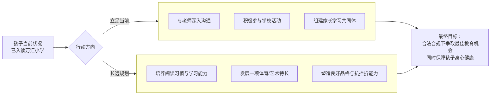
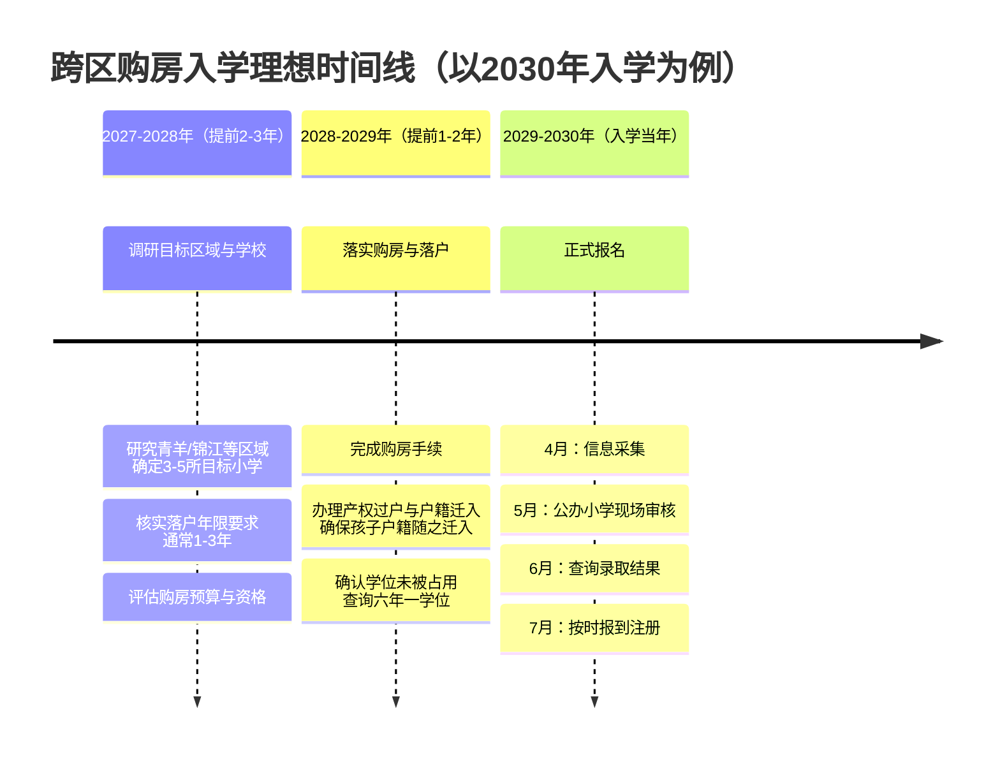
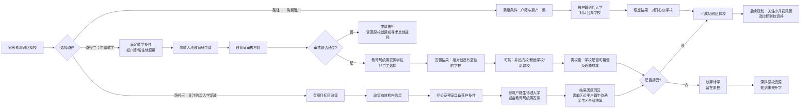
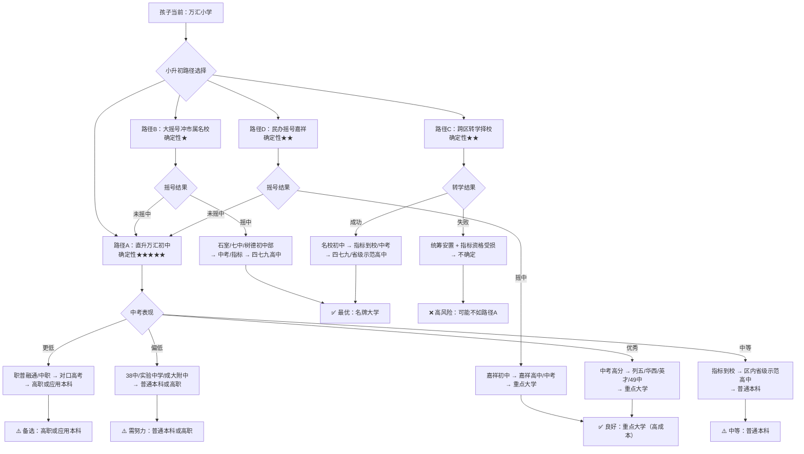

# 成都市成华区择校与升学规划指南

> **文档日期**: 2026-07-03 | **数据截止**: 2025年招生政策 | **适用区域**: 成都市成华区
>
> **免责声明**: 本文基于公开政策文件、官方招生平台及家长口碑信息整理，仅供参考。教育政策动态变化，请以"成都市义务教育招生入学服务平台"和"成华教育"官方微信发布的最新信息为准。学校排名非官方，基于家长口碑、网络评价及部分公开数据综合整理。
>
> **关联文档**: 本文聚焦成华区择校与升学，是《四川教育全景指南：从幼儿园到大学的家长必备手册》的成华区专项细化版。新高考选科（3+1+2模式）、高考特殊通道（强基计划/综合评价/保送/少年班/艺体/军警/定向/港澳）、中考特殊渠道（艺体特长/项目班/航空实验班/职普融通）、少数民族教育政策、跨省教育路径等省级层面内容，请参阅上述全景指南对应章节。

---

## 背景与需求

家长孩子即将上小学，户籍在成都市成华区，摇号入读万汇小学但对学校质量不满意。核心需求：
1. 调研成华区小学、初中、高中的办学条件、师资力量、学费成本及排名
2. 了解除摇号外是否有其他入学渠道（包括"买名额"的风险评估）
3. 了解成都教育政策与孩子成长路径规划
4. 评估未来跨区购房入学的可行性
5. 担忧"换区域是否会被统筹到最差学校"

---

## 目录

- [背景与需求](#背景与需求)
- [一、成华区小学、初中、高中全名单与梯队详情](#一成华区小学初中高中全名单与梯队详情)
  - [1.1 小学全名单与梯队](#11-成华区小学全名单与梯队) · [1.2 初中全名单与梯队](#12-成华区初中全名单与梯队) · [1.3 高中全名单与梯队](#13-成华区高中全名单与梯队)
  - [1.4 课程体系与教学特色对比](#14-课程体系与教学特色对比) · [1.5 重点学校概况](#15-重点学校概况) · [1.6 学校资源配置对比](#16-学校资源配置对比)
- [二、成都入学政策与"万汇"情况分析](#二成都入学政策与万汇情况分析)
- [三、当前阶段行动建议（立足万汇小学）](#三当前阶段行动建议立足万汇小学)
- [四、未来跨区择校与购房入学指南](#四未来跨区择校与购房入学指南)
- [五、跨区转学与"统筹"的真相](#五跨区转学与统筹的真相)
- [六、升学路径全规划](#六升学路径全规划)（含 [6.5 少数民族与跨省路径](#65-少数民族与跨省路径若适用) · [6.6 孩子升学路径情景分析与逆袭策略](#66-孩子升学路径情景分析与逆袭策略) · [6.7 关键约束清单](#67-关键约束清单硬门槛不可变通)）
- [七、常见问题（FAQ）](#七常见问题faq)
- [八、总结与核心建议](#八总结与核心建议)
- [参考文献](#参考文献)

---

## 一、成华区小学、初中、高中全名单与梯队详情

成华区作为成都市中心城区之一，教育资源整体处于上升期，近年来引进成都七中、石室中学、树德中学等优质教育资源，但整体相比青羊、锦江等教育强区仍有差距。以下基于成都本地宝、教育宝、成华区教育局等公开数据整理，涵盖区内全部公民办学校。

### 1.1 成华区小学全名单与梯队

> **关于学费**: 公办小学严格执行国家义务教育免费政策，仅收取校服、伙食、课后服务等少量代收费或服务性收费，每生每年总花费通常在4000元左右。民办学校学费差异大，还需考虑住宿、伙食、代管费等，总成本可能翻倍。

#### 1.1.1 公办小学（30+所）

| 梯队 | 学校名称 | 办学条件 | 师资力量 | 学费/年 |
|:---|:---|:---|:---|:---|
| **第一梯队** | 成都市成华小学（教育集团） | 成都市第一批义务教育名校集团，含本部/南区/西区三校区 | 特级/高级教师比例高，师资稳定 | ~4000元 |
| | 电子科技大学附属实验小学 | 依托电子科大资源，府青路片区 | 高校附属背景，师资较强 | ~4000元 |
| | 成都市建设路小学 | 办学历史悠久，口碑好 | 资深教师多，教研成熟 | ~4000元 |
| | 成都市双林小学 | 经华北路片区，老牌名校 | 师资稳定，骨干教师多 | ~4000元 |
| | 成都市石室小学 | 石室中学领办，双福三路 | 石室系师资输出，起点高 | ~4000元 |
| | 成都市树德小学 | 树德中学领办，万科北街 | 树德系管理，师资优质 | ~4000元 |
| **第二梯队** | 成都市成华实验小学校 | 八里小区文德路，办学扎实 | 骨干教师为主，师资中上 | ~4000元 |
| | 成都市北新实验小学 | 东紫路片区，设施较新 | 师资中上，教研活跃 | ~4000元 |
| | 成都市海滨小学校 | 新山路，校园环境好 | 骨干教师为主 | ~4000元 |
| | 成都市李家沱实验小学校 | 平安正街，老牌公办 | 师资稳定 | ~4000元 |
| | 成都市锦官城小学 | 羊子山西路，设施达标 | 师资中等偏上 | ~4000元 |
| | 成都理工大学附属小学 | 民旺一路，高校附属 | 理工大资源支持 | ~4000元 |
| | 成都市成华区教育科学研究院附属小学 | 致力二路，教研引领 | 教科院指导，师资成长快 | ~4000元 |
| | 成都市双林小学御风分校 | 御风片区，分校模式 | 本部师资辐射 | ~4000元 |
| | 成都市蓉城小学 | 区内公办，口碑中上 | 师资稳定 | ~4000元 |
| | 成都市锦汇东城小学 | 东城片区 | 师资建设中 | ~4000元 |
| | 成都市龙成小学 | 龙潭片区 | 师资建设中 | ~4000元 |
| | 成都市桂林小学 | 桂林片区 | 师资中等 | ~4000元 |
| | 成都大学附属实验小学 | 高校附属模式 | 成大资源支持 | ~4000元 |
| | 四川交响乐团附属小学 | 艺术特色办学 | 交响乐团资源支持 | ~4000元 |
| **第三梯队** | 成都市双庆小学校 | 长天路，基础达标 | 青年教师为主 | ~4000元 |
| | 成都市龙盛小学校 | 龙潭街办院山社区 | 青年教师为主 | ~4000元 |
| | 成都市双水小学校 | 荆顺/荆竹两校区 | 师资成长中 | ~4000元 |
| | 成都市熊猫路小学校 | 熊猫大道，硬件较新 | 青年教师为主 | ~4000元 |
| | 成都市列五书池学校（九年一贯制） | 双桥路，原水碾河小学更名 | 师资中等 | ~4000元 |
| | 成都市华建学校（九年一贯制） | 槐树店路 | 师资成长中 | ~4000元 |
| | 成都英才学校（十二年一贯制） | 二仙桥民兴一路，七中领办 | 七中师资输出，起点高 | ~4000元 |
| | 成都市成华区华青学校 | 桂林西路，新建校 | 师资起步阶段 | ~4000元 |
| | 成都英华学校 | 白龙江路，新建校 | 师资起步阶段 | ~4000元 |
| | 成都市双语实验学校（九年一贯制） | 双林路，双语特色 | 师资中等 | ~4000元 |
| | 成都万汇学校（九年一贯制） | 华林一路41号，公办民管（城投万汇教育集团领办） | 万汇教育集团师资支持，小班化≤30人/班 | ~4000元 |

#### 1.1.2 民办小学（5所）

| 学校名称 | 办学条件 | 师资力量 | 学费/年 | 备注 |
|:---|:---|:---|:---|:---|
| 成都嘉祥外国语学校成华校区（小学部） | 二仙桥北二路，十二年一贯制民办寄宿制 | 嘉祥教育集团旗下，师资优质，口碑极佳 | ~42000元 + 伙食费4400元/学期 + 代管费 | 成华区民办头部，面向全市摇号 |
| 成都蜀辉实验学校 | 二仙桥西路，九年一贯制 | 师资中等 | 约1-2万元/年 | 民办，面向全市招生 |
| 成都市成华区才艺学校 | 二仙桥北路，九年一贯制 | 艺术特色 | 约1-2万元/年 | 民办，艺术特色办学 |
| 成都市成华区和谐学校 | 区内民办 | 师资中等 | 约1-2万元/年 | 民办，面向全市招生 |
| 成都列五中学南华实验学校 | 成华大道崔家店路，民办 | 列五系师资 | 约1.5-2.5万元/年 | 民办初中为主，含小学 |

### 1.2 成华区初中全名单与梯队

> **重要提示**: 成华区初中整体质量在成都"5+2"区域中排在中后段。但第一梯队的几所学校实力不俗，是区内家长趋之若鹜的选择。万汇学校虽为公办，但由万汇教育集团领办，是"跨体制"公办学校。

#### 1.2.1 公办初中（22所）

| 梯队 | 学校名称 | 办学条件 | 师资力量 | 学费/年 |
|:---|:---|:---|:---|:---|
| **第一梯队** | 成都英才学校 | 七中领办，十二年一贯制，二仙桥民兴一路 | 七中师资输出，教研能力强，被寄予厚望 | ~4000元 |
| | 成都石室中学初中学校（培华校区） | 石室中学领办，一环路东二段 | 石室系管理，升学率稳居区内前列 | ~4000元 |
| | 成都市第四十九中学校（和美校区） | 树德中学领办，圣灯路，高完中 | 树德系师资，进步神速，区内顶尖 | ~4000元 |
| | 成都市双庆中学校 | 长天路，公办纯初中，双庆教育联盟盟主 | "低进高出"标杆，区内综合排名前三 | ~4000元 |
| **第二梯队** | 四川省成都列五中学（红星校区） | 双林路双园巷，高完中，省一级示范性高中 | 师资优质，初中部区内靠前 | ~4000元 |
| | 列五中学双桥校区 | 双园巷，列五教育集团 | 列五系师资输出 | ~4000元 |
| | 成都市华西中学 | 双建路，高完中，省一级示范性高中，电子科大附中 | 电子科大资源支持，初中部尚可 | ~4000元 |
| | 石室初中（青龙校区） | 致强环街，石室系分校 | 石室系管理 | ~4000元 |
| | 成都市双语实验学校 | 双林路，九年一贯制，双语特色 | 师资中等偏上 | ~4000元 |
| | 成都市双语实验学校和悦分校 | 和悦片区，分校模式 | 本部师资辐射 | ~4000元 |
| | 成都市实验中学 | 区内公办完中 | 师资中等偏上 | ~4000元 |
| | 成都市双庆中学校龙潭分校 | 成康路，双庆系分校 | 双庆系管理 | ~4000元 |
| | 成都列五联合中学 | 双桥路，列五系 | 列五系师资 | ~4000元 |
| **第三梯队** | 成都市第四十中学校 | 西林二街 | 师资成长中 | ~4000元 |
| | 成都市第三十八中学校 | 北湖生态公园湖滨二路 | 师资成长中 | ~4000元 |
| | 成都大学附属中学 | 三友路，高完中 | 成大资源支持 | ~4000元 |
| | 成都市二仙桥学校 | 二仙桥北路，九年一贯制 | 师资中等 | ~4000元 |
| | 成都市熊猫路学校 | 斧头山一巷，九年一贯制 | 师资起步阶段 | ~4000元 |
| | 成都市华建学校 | 槐树店路，九年一贯制 | 师资成长中 | ~4000元 |
| | 成都市成华区华青学校 | 桂林西路，新建校 | 师资起步阶段 | ~4000元 |
| | 成都英华学校 | 白龙江路，新建校 | 师资起步阶段 | ~4000元 |
| | 成都万汇学校 | 华林一路41号，九年一贯制，公办民管 | 万汇教育集团师资支持，模式创新 | ~4000元 |

#### 1.2.2 民办初中（6所）

| 学校名称 | 办学条件 | 师资力量 | 学费/年 | 备注 |
|:---|:---|:---|:---|:---|
| 成都嘉祥外国语学校成华校区（初中部） | 熊猫大道1124号（新校区），十二年一贯制 | 嘉祥教育集团，民办初中"五朵金花"之一 | ~42000元 + 伙食费 + 住宿费 | 成华区民办头部，摇号竞争激烈 |
| 成都列五中学南华实验学校 | 成华大道崔家店路 | 列五系师资 | 约1.5-2.5万元/年 | 民办，面向全市招生 |
| 成都市成华区才艺学校 | 二仙桥北路 | 艺术特色师资 | 约1-2万元/年 | 民办，艺术特色 |
| 成都蜀辉实验学校 | 二仙桥西路，九年一贯制 | 师资中等 | 约1-2万元/年 | 民办 |
| 成都市成华区和谐学校 | 区内民办 | 师资中等 | 约1-2万元/年 | 民办 |
| 牛津国际公学成都学校 | 区内民办 | 国际化师资 | 约5-8万元/年 | 国际方向，面向全市招生 |

### 1.3 成华区高中全名单与梯队

> **关于"指标到校"**: 这是成都中考的一个重要政策，将优质普通高中部分招生计划分配到初中学校。2025年成都市市级统分指标总数为1269名，其中成华区分配到149个市级统分指标。在成华区初中就读，有机会通过指标到校升入优质高中。**符合政策规定转学的学生，须在学籍转入的初中学校实际就读满2年及以上**方可申请指标到校，且转学须在初二第一学期前完成。这是择校时需要重点考虑的因素。

#### 1.3.1 公办高中（9所）

| 梯队 | 学校名称 | 等级 | 办学条件 | 师资力量 | 学费/年 |
|:---|:---|:---|:---|:---|:---|
| **第一梯队** | 四川省成都列五中学 | 省一级示范性 | 双林路双园巷，省首批重点中学，成都市领航高中，创办于1904年 | 特级教师/省市级名师多，师资雄厚 | ~4000元 |
| | 四川省成都华西中学（电子科大附中） | 省一级示范性 | 双建路（双建校区，123亩）+ 桂龙校区（2025年新投用），两校区共178亩、84个教学班 | 电子科大资源支持，名师众多，"院士摇篮" | ~4000元 |
| **第二梯队** | 成都市第四十九中学校（树德成华中学） | 省二级示范性 | 圣灯路，树德中学领办，2018年获省二级示范高中，枫林新校区2019年投用 | 树德系师资，进步神速，统招线持续上升 | ~4000元 |
| | 成都英才学校 | 公办（十二年一贯制） | 二仙桥民兴一路，七中领办，2022年高中部正式投用 | 七中师资输出，被寄予厚望，未来有望成为区内霸榜学校 | ~4000元 |
| **第三梯队** | 成都市第三十八中学校 | 公办 | 北湖生态公园湖滨二路 | 师资达标，青年教师为主 | ~4000元 |
| | 成都市实验中学 | 公办完中 | 区内公办 | 师资中等 | ~4000元 |
| | 成都大学附属中学 | 公办完中 | 三友路 | 成大资源支持 | ~4000元 |
| | 成都市成华区华青学校 | 公办（新建） | 桂林西路 | 师资起步阶段 | ~4000元 |
| | 成都市成华区综合高级中学 | 公办（职普融通） | 成都职业技术学校挂牌 | 职普融通培养模式 | ~4000元 |

#### 1.3.2 民办高中（1所）

| 学校名称 | 办学条件 | 师资力量 | 学费/年 | 备注 |
|:---|:---|:---|:---|:---|
| 成都市成华区嘉祥外国语高级中学 | 熊猫大道1124号，2019年开设高中部，十二年一贯制 | 嘉祥教育集团，师资优质 | ~42000元 + 伙食费 + 住宿费 | 成华区唯一民办高中，面向"5+2"区域招生400名 |

> **2025年成华区市级统分指标分布**（总数149个，市教育局公示）: 38中16个，石室培华12个，列五11个，49中10个，石室青龙/石室北湖/华西中学/49中和美各8个，双庆龙潭7个，40中/双庆/成都实验/列五双桥各6个，华青学校5个，双语/二仙桥各4个，双语和悦/成大附中各3个，华建2个，熊猫路学校/万汇学校各1个，其余约14个分配至区内其他符合条件初中。各校具体名额以[成都市教育局公示数据](https://www.163.com/dy/article/JVTORENM0512GMQ3.html)为准。

### 1.4 课程体系与教学特色对比

成华区各校虽均执行国家义务教育课程方案，但在课程体系、班型设置、外语教学、STEM/科创、艺体教育、班额、教学方式、升学出口等维度差异显著。以下分小学、初中、高中三阶段进行对比，并附总结矩阵。

#### 1.4.1 小学阶段课程对比

| 维度 | 公办普通小学 | 公办名校小学 | 万汇学校（公办民管） | 嘉祥外国语成华校区（民办） |
|:---|:---|:---|:---|:---|
| **代表学校** | 双庆小学、龙盛小学、双水小学等 | 成华小学、电子科大附小、双林小学、石室小学、树德小学 | 万汇学校 | 嘉祥外国语成华校区 |
| **课程体系** | 国家课程为主，校本课程有限 | 国家课程+特色校本课程，名校集团化课程辐射 | "汇美课程"体系：国家课程+增值课程（PBL、阅读、礼仪、小语种） | "小种子课程"体系：国家基础课程+校本拓展课程+创新荣誉课程，"三级五维"架构 |
| **外语教学** | 统一教材，每周3-4节 | 统一教材，部分名校有英语特色教研 | 英语为主，增设法语/日语/西班牙语小语种选修 | 英语为特色学科，"快乐英语"体系，教研组获区级一等奖，教师课例入选国家智慧教育平台 |
| **STEM/科创** | 基础科学课 | 双林小学：教育部中小学人工智能教育基地（全省仅6所）；电子科大附小：教育部义务教育教学改革实验校（成都唯一入选）；华西中学：全国中小学科学教育实验校 | PBL项目式学习，创新思维培养 | 全国青少年航天科普基地校，科技馆科学课全国示范校，科创荣誉校队屡获国际国内奖 |
| **艺体教育** | 基础音体美 | 成华小学：名校集团优质资源；树德小学：树德系艺体课程 | "情趣乐园"文化，艺术氛围浓厚 | 全国青少年校园足球特色学校，成都市排球团体会员，成都市艺术教育特色学校 |
| **班额** | 40-45人/班 | 40-45人/班 | 小班化，≤30人/班 | 小班化，约30人/班 |
| **教学方式** | 传统班级授课制 | 传统班级授课制，名校教研更强 | 小学"包班制"（班主任办公室在教室内），中学"导师制" | 分层教学，个性化辅导，"5+1+1"培养目标 |
| **特色课程** | 因校而异，较少 | 电子科大附小："新学堂"课程体系，"每天锻炼三小时""走班制""成长课堂"等13项改革；双林小学："双馨文化"（科创之馨+艺术之馨） | PBL、阅读、爱国主义课程、校园礼仪、小语种 | 经典诵读课程、"乐·智"拼音/识字课程、生物建模、走进心理、玩转地球、历史与文化、天府之国研学 |

> **关键差异总结**: 公办普通小学以国家课程为主，特色课程有限；公办名校小学（电子科大附小、双林小学等）依托高校/名校资源，在科创/教研方面有国家级特色项目；万汇学校以"公办民管"模式引入民办课程理念，小班化+导师制是其核心优势；嘉祥外国语课程体系最丰富，外语/科创/艺体三位一体，但学费高昂（~42000元/年）。
>
> **与您孩子的关联**: 您的孩子目前在万汇学校（小学部），其"汇美课程"体系和小班化教学在公办体系中属于差异化优势。若未来考虑小升初，公办名校初中（石室初中、英才、49中）的课程丰富度和出口成绩更具竞争力。

#### 1.4.2 初中阶段课程对比

| 维度 | 石室初中（培华/青龙） | 成都英才学校 | 49中（树德成华） | 双庆中学 | 万汇学校 | 嘉祥外国语成华校区 |
|:---|:---|:---|:---|:---|:---|:---|
| **课程体系** | "正心教育"课程体系 | "英范才德/英智才学/英发才干/英姿才气"四大课程体系 | 树德系课程体系 | 科技教育特色课程 | "汇美课程"体系 | 嘉祥"五力共育"课程体系 |
| **班型设置** | 云创班、云班、平行班 | 创新实验班、英才实验班、强基实验班 | 英才班、火箭班、实验班、平行班 | 平行班为主，科技特长班 | 小班化，≤30人 | 实验班、平行班 |
| **科创特色** | VEX机器人（世界冠军）、建筑模型、信息学竞赛 | 科技创新班（项目班），拔尖创新人才早期培养 | 科技教育示范校 | 四川省科技教育示范校，全国青少年机器人比赛冠军 | PBL项目式学习 | 全国航天科普基地校 |
| **艺体特色** | 健美操（全国特等奖）、管乐团、百人踢踏舞 | 管弦乐团、游泳、足球、排球、体育舞蹈 | 阳光体育示范校 | 合唱团全区闻名，田径队 | "情趣乐园"课程 | 排球、足球、艺术教育特色学校 |
| **外语教学** | 统一教材 | 多语种选修 | 双语特色（部分） | 常规英语 | 小语种选修 | 英语特色突出，"快乐英语"体系 |
| **教学方式** | "三步递升"+"翻转课堂"，微格教研 | 小班化、分层分类走班、网班/云班/未来课堂 | 分层教学 | 管理严格，"乖娃娃培养基地"，校风好 | 小学包班制+中学导师制 | 统一教材+统一教研+统一考试（与嘉祥锦江同步） |
| **班额** | ~50人/班 | 小班化 | ~45-50人/班 | ~45-50人/班 | ≤30人/班 | ~30-35人/班 |
| **中考重点率** | ~60% | 新校，数据尚少 | 区内前列 | 区内前三，"低进高出" | 办学时间短 | 连续十年获区教育教学"突出贡献奖" |

> **关键差异总结**: 初中阶段是分化的关键节点。石室初中以科创教育见长（机器人世界冠军），英才学校以七中资源+四大课程体系+拔尖创新培养为特色，49中以"低进高出"和火箭班闻名，双庆中学以科技教育+严格管理为标签，万汇学校以小班化+导师制为核心优势，嘉祥以课程丰富度+中考出口成绩领先但学费高昂。

#### 1.4.3 高中阶段课程对比

| 维度 | 列五中学 | 华西中学 | 49中 | 英才学校 | 嘉祥外国语高级中学 |
|:---|:---|:---|:---|:---|:---|
| **等级** | 省一级示范性 | 省一级示范性 | 省二级示范性 | 公办（七中领办） | 民办 |
| **班型设置** | 实验班、平行班 | 实验班（小尖班）、平行班 | 英才班、火箭班、实验班、平行班 | 创新实验班、英才实验班、强基实验班 | 实验班、平行班 |
| **课程体系** | 省一级标准课程体系，拔尖创新人才早期培养基地 | 电子科大资源支持，"三级课程体系"（通识+特色+实践），科技创新实验室 | 树德系课程体系 | "英范才德/英智才学/英发才干/英姿才气"四大课程体系 | 嘉祥"五力共育、五育并举"课程体系 |
| **选科走班** | 3+1+2模式，开齐12类组合 | 3+1+2模式 | 3+1+2模式 | 3+1+2模式，分层分类走班 | 3+1+2模式 |
| **科创/竞赛** | 数学奥林匹克分校 | 全国中小学科学教育实验校，电子科大合作 | 科技教育示范校 | 科技创新班（项目班），强基课程，高校衔接 | 科创荣誉校队 |
| **高考出口** | 区内公办头部 | 区内公办头部 | 一本率~90%（火箭班~100%） | 新校，起点高，被寄予厚望 | 连续四年获区教育教学"表彰奖" |
| **特色项目** | 拔尖创新人才早期培养 | 桂龙校区2025年新投用，足球特色学校 | 树德中学领办，进步神速 | 七中全面领办，校长来自七中校长助理 | 十二年一贯制，初高中衔接优势 |

> **关键差异总结**: 高中阶段列五/华西为省一级头部，49中以火箭班高一本率著称，英才学校以七中嫡系+拔尖创新培养为最大看点，嘉祥以民办精品路线+连续四年表彰奖为特色。新高考3+1+2选科走班已在全区高中推行。
>
> **新高考选科详见**: 《四川教育全景指南》§七（大学阶段新高考），涵盖3+1+2模式详解、12种选科组合专业覆盖率、院校专业组录取规则等。核心要点："物理+化学"组合覆盖约95%专业，选历史则限文科专业。

#### 1.4.4 课程维度对比总结矩阵

| 维度 | 公办普通校 | 公办名校 | 万汇学校 | 嘉祥外国语 |
|:---|:---|:---|:---|:---|
| **课程丰富度** | ★★ | ★★★ | ★★★★ | ★★★★★ |
| **班额/关注度** | ★★（40-45人） | ★★★（45-50人） | ★★★★★（≤30人，导师制） | ★★★★（~30-35人） |
| **外语特色** | ★★ | ★★★ | ★★★★ | ★★★★★ |
| **科创教育** | ★★ | ★★★★ | ★★★ | ★★★★★ |
| **艺体教育** | ★★ | ★★★ | ★★★ | ★★★★★ |
| **中考出口** | ★★ | ★★★★ | ★★★（办学短） | ★★★★★ |
| **管理严格度** | ★★★ | ★★★★ | ★★★★（导师制） | ★★★★★ |
| **学费成本** | ★（~4000元） | ★（~4000元） | ★（~4000元） | ★★★★★（~50000元+） |
| **性价比** | ★★★ | ★★★★★ | ★★★★★ | ★★★ |

> **择校启示**: 公办名校（石室初中、49中、英才、双庆）在课程丰富度和出口成绩上已能满足大部分需求，性价比最高。万汇学校以小班化+导师制形成差异化优势，适合关注个性化教育的家庭。嘉祥外国语课程最丰富但学费高昂，适合预算充足且追求民办精英教育的家庭。
>
> **课程数据来源**: 嘉祥外国语课程体系引自嘉祥教育集团官网（jxfls.com）及2024年招生简章；万汇学校"汇美课程"体系引自城投万汇教育集团官网及四川教育在线报道；电子科大附小"新学堂"课程体系引自教育部义务教育教学改革实验校公示及四川教育在线；双林小学人工智能教育基地引自教育部首批中小学人工智能教育基地名单；石室初中"正心教育"课程及VEX机器人成绩引自石室初中官方介绍及成都本地宝；英才学校四大课程体系引自成都英才学校2024年项目班招生公告及四川教育在线；49中班型及高考数据引自升学问答网公开数据；双庆中学科技教育特色引自百度百科及知乎专栏。

### 1.5 重点学校概况

> 以下为成华区重点学校的结构化档案，涵盖建校历史、办学规模、联系方式、核心荣誉及定位。按学段+梯队排列。

#### 小学阶段重点学校

| 学校 | 创办年份 | 校区/面积 | 规模 | 地址 | 电话 | 领办/附属 | 核心荣誉 | 一句话定位 |
|:---|:---|:---|:---|:---|:---|:---|:---|:---|
| **电子科大附小** | 1956（前身电子科大子弟校），2006与府青小学合并更名 | 五校区（沙河/府青/蓝水湾/华泰/华翰），总占地90余亩 | 135个教学班，6800余名学生，400余名教师 | 府青路二段3号附2号 | 028-83267291 | 电子科大与成华区合作共建 | 教育部义务教育教学改革实验校（成都唯一）；四川省义务教育优质发展共同体领航学校；成都市基础教育名校集团领航学校 | "新学堂"个性化教育改革标杆，全省推广 |
| **成华小学** | 1991 | 三校区（秀美/和美/华美）+蜀都分校 | — | 新鸿南路77号 | 028-84381569 | 成华区直属 | 成都市首批义务教育名校集团；四川省校风示范校；四川省百所艺术教育特色学校；成都市"未来学校"试点校 | "以美育人"特色，成都"新五金花"之一 |
| **双林小学** | 1988 | 三校区（馨源/馨桥/馨韵） | 53个教学班，近2500名学生，145名教师 | 经华北路14号附5号 | 028-84332369 | 成华区直属，成都市首批优质教育集团龙头 | 教育部首批中小学人工智能教育基地（全省仅6所）；全国首批人工智能教育培训基地；四川省校风示范校；成都"新五朵金花"；成都最美小学 | "双馨教育"（科创+人文），民乐特色闻名 |
| **石室小学** | 2010 | 主校区（双福三路62号，30亩）+育贤分校（高车三路130号），一体化管理 | 63个教学班，168名教师 | 双福三路62号 | 028-84506013 | 石室中学领办 | 青少年校园足球特色学校；应急教育示范学校 | "尚贤教育"理念，石室系小学部 |
| **树德小学** | 1929（始创），2010年原址复建 | 万科北街校区（约21.4亩）+和韵校区（和韵路166号，2021年投用） | 58个教学班，3300余名学生，近200名教师 | 万科北街9号 | 028-61538096 | 树德中学领办（原双林小学教育集团管理） | 百年树德历史传承 | "树德立人"+"童真教育"，树德系小学部 |

#### 初中阶段重点学校

| 学校 | 创办年份 | 校区/面积 | 规模 | 地址 | 电话 | 领办/附属 | 核心荣誉 | 一句话定位 |
|:---|:---|:---|:---|:---|:---|:---|:---|:---|
| **石室初中（培华校区）** | 2009（石室中学领办原30中） | 培华校区26.7亩+青龙校区36.9亩+华青学校59.4亩（华青为石室领办的独立招生校，单独参与指标到校） | 近100个教学班，近5000名学生，400余名教职工 | 培华西路3号 | 028-84338522 | 石室中学领办 | VEX机器人世界冠军（2011-2015多次）；成都市超一流高中优质生源基地校 | 成华区公办初中数一数二，科创教育标杆 |
| **成都英才学校** | 2021（小学初中），2022（高中） | 小初部150亩（民兴一路500号）+高中部（仙韵五路666号），总占地约150亩，总投资约15亿元 | 小学36班+初中30班+高中30班，在校学生5400余人 | 民兴一路500号 | 028-60214625 | 成都七中领办 | 2025年统招录取线621分；拔尖创新人才早期培养试点 | 成华区唯一十二年一贯制公办，七中嫡系"黑马" |
| **49中（树德成华）** | 1977（原名圣灯中学，1992年更名） | 枫林校区+和美校区（48亩，30135㎡） | 68个教学班，3200余名学生，258名教职工 | 圣灯路39号 | 028-84123153 | 树德中学领办（又称树德成华中学） | 省二级示范性普通高中；四川省校风示范校；四川省现代教育技术示范校；成都市科技教育示范校 | "低进高出"标杆，火箭班一本率~90% |
| **双庆中学** | 1997（另据国家知识产权局来源为1999） | 总校+龙潭分校（成康路77号，1180人，84名教师） | 43个教学班，师生两千余人 | 长天路9号 | 028-84447032 | 成华区直属 | 四川省科技教育示范学校；国家青少年科普教育实验基地；全国青少年机器人比赛冠军（2010）；连续三年获成华区教育教学突出贡献奖 | "代表四川省青少年科技教育初中阶段最高水平" |
| **万汇学校** | 2018 | 华林一路41号，占地38亩 | 设计54个班，可提供2500个学位 | 华林一路41号 | —（未公开，见[成都市教育局学校信息大全](http://infomap.cdedu.com/Home/School?Id=5e91384a-32ce-47e3-a759-ea5100836f26)） | 成华区政府举办，城投万汇教育集团领办（公办民管） | 成都市首所由优质民办教育集团领办的公办学校 | "两自一包"体制，小班化+包班制+导师制 |

#### 高中阶段重点学校

| 学校 | 创办年份 | 校区/面积 | 规模 | 地址 | 电话 | 领办/附属 | 核心荣誉 | 一句话定位 |
|:---|:---|:---|:---|:---|:---|:---|:---|:---|
| **列五中学** | 1904（叙府公立中学堂，1994年更名列五中学） | 双林路双园巷，占地73亩，建筑面积36764㎡ | 初中36班+高中32班，3800余名学生，教职工285人 | 双林路双园巷9号 | 028-84318573 | 成华区直属 | 省一级示范性普通高中（引领型，2022年评定）；四川省首批重点中学；成都市首批优质教育集团（2009） | 成华区公办高中头部，百年名校 |
| **华西中学（电子科大附中）** | 1908（华西协合预备学堂，1953年更名成都十三中，2000年迁建更名，2004年加挂电子科大附中） | 双建校区+桂龙校区（2025年新投用），总占地178亩 | 84个教学班，4000余名学生，教职工近400人 | 双建路双建南巷1号 | 028-83241025 | 电子科技大学附属中学 | 省一级示范性普通高中；全国中小学科学教育实验校；全国青少年航天科普活动基地校；四川省首批重点中学；四川省首批智慧教育示范学校 | "院士摇篮"（朱清时/陈霖/邱蔚六等校友），主城区面积最大公办学校之一 |
| **49中（高中部）** | 1977 | 枫林校区+和美校区 | 68个教学班，3200余名学生 | 圣灯路39号 | 028-84123153 | 树德中学领办 | 省二级示范性普通高中；连续五年获成华区高中工作突出贡献奖 | 进步神速，火箭班一本率~90% |
| **英才学校（高中部）** | 2022 | 仙韵五路666号 | 高中30个班 | 仙韵五路666号 | 028-60214625 | 成都七中领办 | 2025年统招线621分；科技创新班项目班（面向全市招30名） | 七中全面领办，被寄予"区内霸榜"厚望 |
| **嘉祥外国语高级中学** | 2009（成华校区创建），2019年开设高中部 | 二仙桥校区+熊猫大道校区，总面积140余亩 | 在校学生4090余人（含小初高） | 熊猫大道1124号 | 028-64201263 | 四川嘉祥教育集团（民办） | 初中连续七年获成华区教育教学突出贡献奖；全国青少年校园足球特色学校；成都市排球运动团体会员单位（注：省一级示范性荣誉属锦江本部） | 成华区唯一民办高中，民办精英教育路线 |

> **概况数据来源**: 详见[§参考文献](#参考文献)。列五中学数据引自[百度百科](https://baike.baidu.com/)及[成都学而思1对1](https://cd.jiajiaoban.com/e/20201126/5fbfa2fbe8608.shtml)；华西中学数据引自[升学问答网](https://www.cdjnsk.com/zhaoshengwenda/39007.html)及[百度百科](https://baike.baidu.com/)；49中数据引自[好学院招生网](https://www.haoxueyuan.com/school/3546.html)及[成都学而思1对1](https://cd.jiajiaoban.com/e/20210319/60543ed82d1bd.shtml)；英才学校数据引自[成都本地宝](http://cd.bendibao.com/edu/2022628/139696.shtm)及[深圳本地宝](https://cd.bendibao.com/wangdian/dian/5868189.shtm)；石室初中数据引自[百度百科](https://baike.baidu.com/)及[成都本地宝](https://m.cd.bendibao.com/wangdian/dian/92328.shtm)；双庆中学数据引自[百度百科](https://baike.baidu.com/)及[city8090](https://m.city8090.com/xuexiao/chuzhong-4072/)；万汇学校数据引自[成都市教育局学校信息大全](http://infomap.cdedu.com/Home/School?Id=5e91384a-32ce-47e3-a759-ea5100836f26)及[城投万汇教育集团官网](https://cdciedu.com/school/17.html)；嘉祥外国语数据引自[嘉祥教育集团官网](https://ch.jxfls.com/)及[嘉祥教育集团联系方式页](https://www.jxfls.com/channel/330)；电子科大附小数据引自[四川教育在线](https://www.scjyxw.com/xiaoxue/news/20240301/1000010000366126.html)及[360百科](https://baike.so.com/)；成华小学数据引自[百度百科](https://baike.baidu.com/)；双林小学数据引自[360百科](https://baike.so.com/)及[四川教育在线](https://www.scjyxw.com/xiaoxue/news/20240301/1000010000366126.html)；石室小学数据引自[百度百科](https://baike.baidu.com/)及[成都本地宝](https://m.cd.bendibao.com/)；树德小学数据引自[114城市通](https://www.114c.com/chengdu/xuexiao/351410005922021376)及[查号吧](https://www.chahaoba.com/028-61538096)。

### 1.6 学校资源配置对比

> §1.5提供了重点学校的基础档案，本节进一步从**师资结构、硬件设施、特色资源、数字化教学环境、班额与生活配套**五个维度进行横向对比，帮助家长全面理解各校"软实力"差异。

#### 1.6.1 师资结构对比

| 学校 | 教职工总数 | 特级/正高级教师 | 高级教师 | 硕士及以上 | 名优骨干教师 | 师资来源 |
|:---|:---|:---|:---|:---|:---|:---|
| **电子科大附小** | 400余名 | 正高级4名，省特级6名 | —（未公开） | 60余名研究生 | 市区学科带头人24名，省市区名师工作室12个 | 电子科大资源+全国招聘 |
| **双林小学** | 145名 | 特级3名 | 副高级20名 | — | 市学科带头人3名，区学科带头人25名，省市区骨干教师74名 | 成都市首批优质教育集团龙头 |
| **石室初中（三校区）** | 400余名 | —（未单独公开，石室系统筹） | 中高级职称150余人 | —（未公开） | 名优骨干教师超70% | 石室中学选拔标准，面向全国选聘 |
| **英才学校** | 90名（高中部，2022年数据） | 特级1名 | 25名（占比28%） | 硕士35名，博士1名 | — | 七中派出校长/副校长/中层干部/学科骨干，均在七中工作15-30年 |
| **49中** | 258名 | 省市特级2名 | 高中级职称72名（旧数据，实际比例应更高） | 初中教师本科以上达97% | 省骨干教师4名，市区学科带头人24名，市区优秀教师190余人 | 树德系师资输出 |
| **列五中学** | 448名（2025年数据） | 省特级5名，市特级校长1名 | 高级教师占比40% | 硕士占比超40%（百余人毕业于全国顶尖名校） | 省市区学科带头人/优秀教师共357名，名师工作室领衔人3名 | 成华区直属，百年名校积淀 |
| **华西中学** | 近400名 | 特级5名 | 高级95名 | — | 市学科带头人2名，市高三中心组成员9名，市优秀青年教师18名，省市区名优骨干教师200余人 | 电子科大资源支持 |
| **嘉祥外国语（成华）** | 100余名专职教师 | 锦江区特级教师1名（本部派驻） | 高级教师占比高（含本部派驻高级教师多名） | 博士及硕士占比60% | 嘉祥教育集团统一调配，与锦江本部统一教研；成都市学科带头人、优秀青年教师多名 | 嘉祥教育集团统一调配，与锦江本部统一教研 |
| **万汇学校** | —（未公开） | 全国优秀校长1名（张良），省特级教师若干 | —（未公开） | —（未公开） | 汇聚四七九本部、成实外、嘉祥系资深教师（据新浪新闻报道） | 城投万汇教育集团领办，公办民管 |
| **双庆中学** | ~164名（总校80+龙潭分校84） | —（未公开） | —（未公开） | —（未公开） | 师生比约1:14.75 | 成华区直属 |

> **师资差异解读**: 列五中学以省特级5名+高级占比40%+硕士占比超40%+357名市区级名优教师领先区内公办；华西中学在特级教师数量（5名）和高级教师规模（95名）上同样雄厚；英才学校以七中嫡系师资（干部均在七中工作15-30年）和高学历结构（硕士35名+博士1名）为最大亮点；石室初中名优骨干教师占比超70%，整体师资结构均衡；万汇学校以"全国优秀校长+省特级教师+国际教育资源"形成差异化配置，但规模数据未公开。

#### 1.6.2 硬件设施与校园环境对比

| 学校 | 占地面积 | 建筑面积 | 校区数 | 特色设施 | 校园特色 |
|:---|:---|:---|:---|:---|:---|
| **华西中学** | 178亩（双建+桂龙） | 4万余㎡ | 2 | 8470㎡天然草坪足球场+8370㎡人工草坪足球场+3852㎡体育馆+标准游泳池+8600㎡田径场 | "成都最美高中"，主城区面积最大公办学校之一 |
| **英才学校** | ~150亩 | ~14.47万㎡ | 2（小初+高中） | 总投资约15亿元，高标准新建 | 2.5环二仙桥公园旁，现代化智慧校园 |
| **列五中学** | 73亩 | 36764㎡ | 2（双林+双桥） | 400米跑道标准田径场+足球场+排球场+篮球场+形体练功房+合唱排练厅+图书馆+科技创作室+美术画廊 | 百年老校，2018年高中部新校区投用 |
| **嘉祥外国语（成华）** | 140余亩 | — | 2（二仙桥+熊猫大道） | 多功能智慧教室+寄宿制设施 | 民办寄宿制，校园环境优美 |
| **电子科大附小** | 90余亩 | — | 5 | 110张乒乓桌+2个塑胶运动场+标准网球运动场+5间网络教室 | 五校区分布府青街道两侧 |
| **49中** | 48亩（和美校区） | 30135㎡（和美校区） | 2（枫林+和美） | 标准教学楼+实验楼+学生食堂+学术厅+室内体育馆+200米跑道运动场 | 区政府投入3.1亿改扩建，智慧校园 |
| **万汇学校** | 38亩 | — | 1 | 砖红色建筑，现代化教学设施 | 二仙桥片区，2018年新建 |
| **石室初中** | 123亩（三校区合计） | — | 3（培华+青龙+华青） | 全数字化多媒体教室+高性能笔记本电脑教学+多媒体资源库 | 2024年培华校区提升改造完工 |
| **双林小学** | — | — | 3（馨源+馨桥+馨韵） | — | 成都市"最美校园" |
| **石室小学** | 30亩 | 1.6万余㎡ | 2（主校+育贤） | 全多媒体教学+室内体育馆+10万册图书馆 | — |
| **树德小学** | 21.4亩 | 9397㎡ | 2（万科北+和韵） | — | 2021年和韵校区新建投用 |

> **硬件差异解读**: 华西中学以178亩+全套体育设施领先；英才学校以15亿投资打造现代化智慧校园；列五中学百年积淀设施齐全；万汇学校38亩规模较小但2018年新建硬件较新；嘉祥以民办寄宿制提供全天候教育环境。

#### 1.6.3 特色资源与外部合作对比

| 学校 | 高校/名校合作 | 国际资源 | 特色实验室/基地 | 集团化办学 |
|:---|:---|:---|:---|:---|
| **华西中学** | 电子科技大学附属中学 | 教育国际化窗口学校 | 全国中小学科学教育实验校；全国青少年航天科普活动基地校；小平科技创新实验室 | 电子科大附属（非集团化） |
| **英才学校** | 成都七中全面领办（校长来自七中校长助理） | — | 科技创新班（项目班）；拔尖创新人才早期培养试点 | 七中教育集团 |
| **石室初中** | 石室中学领办 | — | VEX机器人实验室（世界冠军级）；建筑模型实验室；信息学竞赛基地 | 石室教育集团 |
| **49中** | 树德中学领办（挂牌树德成华中学） | 国际生态学校 | 科技教育示范校；国家科研兴校先进单位 | 树德教育集团 |
| **电子科大附小** | 电子科大与成华区合作共建 | — | 教育部义务教育教学改革实验校；教育部中小学人工智能教育基地 | 电子科大附小教育集团（五校区） |
| **双林小学** | — | — | 教育部首批中小学人工智能教育基地（全省仅6所）；全国首批人工智能教育培训基地 | 双林小学教育集团（龙头） |
| **列五中学** | — | — | 数学奥林匹克分校；拔尖创新人才早期培养基地 | 列五教育集团（2009年首批） |
| **嘉祥外国语** | 嘉祥教育集团（锦江本部统一教研） | 国际交流项目+外籍教师参与 | 全国青少年航天科普基地校；全国青少年校园足球特色学校 | 嘉祥教育集团 |
| **万汇学校** | 城投万汇教育集团领办 | 芬兰/英国/美国一流国际教育资源 | PBL项目式学习基地 | 城投万汇教育集团 |
| **双庆中学** | — | — | 四川省科技教育示范学校；国家青少年科普教育实验基地；知识产权教育试点 | 双庆教育联盟（盟主） |
| **石室小学** | 石室中学领办 | — | — | 石室教育集团 |
| **树德小学** | 树德中学领办（原双林教育集团管理） | — | — | 树德教育集团 |

> **资源差异解读**: 从合作层级看，英才（七中全面领办）>华西（电子科大附中）>石室初中/49中（石室/树德领办）>万汇（万汇集团公办民管）。从特色基地看，华西和双林拥有国家级科学教育/人工智能基地，石室初中的VEX机器人实验室产出世界冠军级成果。万汇学校的独特优势在于芬兰等国际教育资源引入，在公办体系中较为罕见。

> **资源配置数据来源**: 师资/硬件/特色资源数据来源详见§1.6.5末尾的完整数据来源说明。

#### 1.6.4 软件与数字化教学环境对比

> 成华区于2021年入选**国家级智慧教育示范区**，2024年与科大讯飞合作启动智慧教育示范区创建提升工程，以"5i智慧课堂"为核心构建区域智慧教育生态。以下为各校数字化教学环境差异。

| 学校 | 智慧课堂系统 | 数字阅读平台 | AI/人工智能教学 | 数字化特色 |
|:---|:---|:---|:---|:---|
| **英才学校** | AI智能教室（物联网+AI技术） | 智慧阅读本+数字阅览室（海量书目） | AI口语评测+电子课本+同步音视频 | 智能化教学空间贯穿课内外，"数据说话"替代"经验说话" |
| **华西中学** | 物理数字探究实验室 | — | 人工智能创新实验室（35台智能机器人） | "72228"工程：7果园+2中心+2特色实验室+2科技长廊+8科技景观，"校园就是实验室" |
| **双林小学** | "5i智慧课堂"试点校 | 数字阅读课例《功勋》入选2025年教育部精品课例 | 央馆人工智能课程基地+教育部AI教育基地（双基地校） | 混合式校本研修，链接电子科大/成都理工/川师大资源 |
| **电子科大附小** | 教育部网络学习空间建设优秀学校 | — | 央馆智能研修与人工智能课程规模化应用学校 | "新学堂"数字化教学赋能，"讲堂"变"学堂" |
| **石室初中** | 全数字化多媒体教室+高性能笔记本教学 | — | — | 多媒体资源库（自主知识产权），石室系统共享 |
| **49中** | 智慧校园（区政府3.1亿改扩建投入） | — | — | 现代教育技术示范校 |
| **列五中学** | — | — | — | 拔尖创新人才早期培养基地（数字化辅助） |
| **嘉祥外国语** | 多功能智慧教室 | — | — | 民办集团化数字化资源，与锦江本部共享 |
| **万汇学校** | — | — | — | PBL项目式学习平台，芬兰国际教育资源引入 |
| **双庆中学** | — | — | — | 科技教育示范校（传统科创特色，数字化程度未公开） |
| **石室小学** | 全多媒体教学 | 10万册图书馆 | — | — |
| **树德小学** | — | — | — | — |

> **数字化差异解读**: 英才学校在数字化教学环境上领先（AI智能教室+智慧阅读本+物联网+AI技术），这与其15亿投资和2021年新建校定位一致；华西中学以"72228"工程将校园整体打造为科学探究空间，理念创新；双林小学和电子科大附小作为国家级AI/智慧教育试点校，在小学阶段数字化程度最高；万汇学校和双庆中学的数字化环境数据未公开，但万汇的PBL+芬兰国际资源是差异化软件优势。**成华区全区已实现数字阅读产品全覆盖**，师生累计阅读超12万小时，15校入选教育部"图书馆数字化赋能读书行动领航计划"。

#### 1.6.5 班额、师生比与生活配套对比

| 学校 | 班额（人/班） | 师生比 | 寄宿 | 餐饮 | 通勤便利度 |
|:---|:---|:---|:---|:---|:---|
| **万汇学校** | ≤30（小班化） | —（未公开） | 无（走读） | 学校食堂 | 二仙桥片区，地铁7号线附近 |
| **英才学校** | —（未公开，设计小学36班+初中30班+高中30班） | — | 有（高中部可寄宿） | 学校食堂 | 民兴一路500号，二仙桥公园旁 |
| **嘉祥外国语（成华）** | —（未公开） | — | **全日制寄宿**（民办特色） | 学校食堂（寄宿制配套） | 熊猫大道1124号，地铁3号线附近 |
| **列五中学** | —（初中36班+高中32班，3800余人） | 约1:8.5 | 高中部可寄宿 | 学校食堂 | 双林路双园巷，市中心交通便利 |
| **华西中学** | —（84班，4000余人） | 约1:10 | 有（部分寄宿） | 学校食堂 | 双建路，地铁7号线双店路站 |
| **49中** | —（68班，3200余人） | 约1:12.4 | 有（部分寄宿） | 学校食堂 | 圣灯路39号，地铁8号线附近 |
| **石室初中** | —（近100班，近5000人） | 约1:12.5 | 无（走读） | 学校食堂 | 培华西路3号，地铁6号线附近 |
| **双庆中学** | ~51（2017年数据） | 约1:14.75 | 无（走读） | 学校食堂 | 长天路9号 |
| **电子科大附小** | —（135班，6800余人） | 约1:17 | 无（走读） | — | 府青路，地铁7号线府青路站 |
| **双林小学** | —（53班，近2500人） | 约1:17.2 | 无（走读） | — | 经华北路14号 |
| **石室小学** | —（63班） | — | 无（走读） | — | 双福三路62号 |
| **树德小学** | —（58班，3300余人） | 约1:16.5 | 无（走读） | — | 万科北街9号 |

> **班额差异解读**: 万汇学校以≤30人/班的小班化教学在区内公办学校中独树一帜，这是其"公办民管"体制的核心优势——在公办免费的前提下实现了接近民办的小班体验。其他公办学校班额普遍在40-55人之间。嘉祥外国语作为民办寄宿制学校，是区内唯一提供全日制寄宿的学校，适合工作繁忙或希望孩子接受全天候教育的家庭。
>
> **与您孩子的关联**: 万汇学校的≤30人/班小班化+导师制是其在资源配置上的最大亮点。在30人以下的班级中，教师对每个学生的关注度远高于50+人的大班。这意味着在万汇初中，您的孩子有更多机会获得个性化指导和课堂互动——这是许多名校大班无法提供的。结合万汇的指标到校竞争压力小（详见§6.6.4），"小班+导师+低竞争"是万汇的独特组合优势。

> **资源配置数据来源**: 详见[§参考文献](#参考文献)。师资数据引自各校招聘公告（2024-2025年）、[百度百科](https://baike.baidu.com/)及[升学问答网](https://www.cdjnsk.com/)；硬件数据引自华西中学官方招聘公告、[成都本地宝](https://m.cd.bendibao.com/)、[百度百科](https://baike.baidu.com/)及[澎湃新闻](https://www.thepaper.cn/)；特色资源引自教育部公示名单、各校官方介绍及[四川教育在线](https://www.scjyxw.com/xiaoxue/news/20240301/1000010000366126.html)；嘉祥成华师资数据引自[51咨询网](https://www.51zixun.com/zhongkao/chengdu/gaozhong/1733732255.html)及[嘉祥教育集团官网](https://ch.jxfls.com/)；万汇学校师资数据引自[新浪新闻](https://cj.sina.com.cn/articles/view/6105713761/16bedcc6102001jp4g)及[澎湃新闻](https://www.thepaper.cn/)；双庆中学师资数据引自[成都学而思1对1](https://cd.jiajiaoban.com/e/20170209/589c279f2a006.shtml)；49中师资数据引自[好学院招生网](https://www.haoxueyuan.com/school/3546.html)及[成都学而思1对1](https://cd.jiajiaoban.com/e/20210319/60543ed82d1bd.shtml)；数字化环境数据引自[科大讯飞智慧教育官网](https://edu.iflytek.com/about-us/news/regional-consultation/2715)、[中新网四川新闻](https://www.sc.chinanews.com.cn/kjws/2024-12-05/220522.html)及[中国日报网](https://ex.chinadaily.com.cn/exchange/partners/82/rss/channel/cn/columns/sz8srm/stories/WS6a3a4bfaa310d709c2fb9ae6.html)；班额/师生比数据引自各校[百度百科](https://baike.baidu.com/)、[澎湃新闻](https://www.thepaper.cn/)及[成都学而思1对1](https://cd.jiajiaoban.com/)。

---

## 二、成都入学政策与"万汇"情况分析

### 2.1 核心入学政策

成都市义务教育阶段招生坚持 **"免试就近入学"** 和 **"公民同招"** 原则。

- **公办学校**: 主要按户籍划片入学。孩子摇号入读万汇小学，说明其户籍应在该校划片范围内。
- **民办学校**: 面向全市招生，报名人数超过计划数时100%电脑随机录取（摇号）。
- **关键时间节点**: 每年4月采集信息、5月民办报名、6月公办审核与录取、7月发榜。请务必密切关注"成都市义务教育招生入学服务平台"（网址: https://yjrx.cdeduypt.cn/）和"成华教育"官方微信。

### 2.2 孩子的情况与"万汇"解读

**现状**: 孩子已取得万汇小学的公办学位。

**"觉得不够好"的担忧**: 万汇小学作为2018年新建校，办学时间较短，在区内公办小学中属第三梯队，口碑尚在积累中，与第一梯队学校（成华小学、电子科大附小、双林小学、石室小学、树德小学）在办学积淀和社会认可度上有差距。

**政策允许的后续选择**:
- **转学**: 成华区每年春季（1月）和秋季（7月）会办理户籍生转学。若希望转学，需满足"人户一致"（户籍与房产地址一致）等条件，由区教育局统筹安排至有空余学位的学校，不能保证进入心仪名校。**注意: 区内转学原则上不办理**，跨区转学（如从成华区转到青羊区）才在政策允许范围内。
- **小升初**: 这是更关键的节点。万汇小学的毕业生将根据政策升入对口初中。成华区初中资源同样不均衡，但小升初时有一次通过"大摇号"或"小摇号"进入更好初中的机会。初中三年后，再通过中考升入高中。

### 2.3 关于"买名额"的郑重提醒

您提到的"中介给钱买名额"操作，风险极高，**强烈不建议尝试**。关于各学校具体收费，由于此类交易本身属违规违法行为，不存在公开可靠的收费标准，所谓"报价"多为中介利用信息差虚构，实际无法保障任何结果。

- **政策明令禁止**: 成都市教育局文件明确规定："严禁以各类考试、竞赛、考测证书、荣誉证书、学科成绩、培训成绩或证书证明等作为招生入学依据或参考；严禁与社会组织、培训机构挂钩招生；严禁违规跨区域招生。" 任何形式的"买卖学位"都属违规，一旦查实，孩子学籍无法注册，钱款可能打水漂，家长还可能承担法律责任。
- **"保障"的陷阱**: 所谓"保障上小学、保障上高中"完全是误导。小学阶段，违规操作无法取得合法学籍；初中阶段，指标到校政策要求实际就读满3年（符合政策规定转学的须满2年），靠非正常渠道入学将失去指标生资格；高中阶段，必须通过中考，凭分数录取，任何承诺"包上高中"都是谎言。
- **"几十万走后门"**: 这通常是骗局或对政策极度不了解的体现。成都义务教育招生已非常透明和规范，所谓"后门"极可能是利用信息差或进行违规操作，最终受害的是孩子。
- **"小学决定终生"是谬论**: 孩子的成长是马拉松，不是百米冲刺。小学阶段更重要的是培养习惯、兴趣和身心健康。一个在普通小学但家庭支持充分、孩子努力向上的孩子，完全有机会在初中、高中乃至大学实现逆袭。

---

## 三、当前阶段行动建议（立足万汇小学）

> 升学制度与路径详情见 **§六（升学路径全规划）**。本节聚焦"现在能做什么"。

**理性看待学校标签，立足当下**: 万汇小学虽非顶尖，但仍有其价值。主动与班主任和学校沟通，了解学校特色和资源，积极参与家校共育。孩子的学习习惯和兴趣培养，家庭的作用远大于学校。

**超越"名校"光环，着眼长远发展**:
- **培养核心能力**: 阅读能力、逻辑思维、专注力、时间管理能力比提前学知识更重要。这些能力一旦形成，在任何学校都会脱颖而出。
- **发展特长**: 体育和艺术特长不仅能强身健体、陶冶情操，在未来的升学中（如艺体特长生）也可能成为加分项。
- **塑造品格**: 培养孩子乐观、坚韧、善良、有责任心的品格。这将是支撑他走得更远、更稳的最宝贵财富。
- **家庭氛围**: 和睦、充满爱和学习氛围的家庭环境，是孩子成长的最好土壤。您的焦虑和过度干预，有时比学校本身对孩子的影响更大。

---

## 四、未来跨区择校与购房入学指南

### 4.1 成都义务教育阶段入学基本规则

成都义务教育阶段招生主要依据 **"户籍"** 和 **"实际居住地"**。

- **公办学校**: 坚持"户籍与实际居住地一致"优先的原则。即孩子户籍需与父母户籍一致，且户籍地址与房产证地址一致。热门学校通常要求"落户年限"（如1-3年），部分学位紧张的学校实行"六年一学位"政策（同一套房产在6年内只能提供一个学位）。**注意: "六年一学位"并非全市统一政策，仅适用于部分发布学位预警的学校/区域（如双流区、崇州市等）**，具体需查询目标学校所在区的最新政策。
- **民办学校**: 面向全市招生，报名人数超过计划数时100%电脑随机录取（摇号）。民办学校摇号与户籍区域无关，只要成都市户籍或符合条件的随迁子女均可报名。

### 4.2 跨区购房入学的关键考量

| 考量维度 | 关键要点 | 风险提示 |
|:---|:---|:---|
| **落户年限** | 热门学校通常要求落户1-3年，需提前规划 | 落户时间不足将被统筹安排 |
| **学位占用** | 购房前务必核实该房产地址学位是否已被占用 | "六年一学位"区域内，已占用的地址无法入学 |
| **购房资格** | 需确认自身具备成都购房资格（户籍/社保等） | 不符合资格无法购房落户 |
| **政策时效** | 各区"购房入学"政策有明确实施期限和截止日期 | 政策到期后购房可能不再享受入学优惠 |
| **小升初影响** | 跨区购房主要解决小学和初中公办学位 | 高中录取主要依据中考成绩，跨区购房不影响高中录取 |
| **指标到校** | 初中转学影响指标到校资格，须在转入校就读满2年 | 初二后才转学将无法满足2年要求，失去指标资格 |

### 4.3 跨区购房入学流程规划

若计划通过购房实现跨区入学，建议遵循以下流程：

> **特别注意**: "小升初"同样受户籍和学籍影响。如果孩子在成华区就读初中，想通过中考跨区考入其他区域的高中，需要满足成都市中考报名条件（通常要在成都连续就读初中并完成初中学业）。跨区购买学区房主要解决的是"小学"和"初中"的公办学位问题，高中录取主要依据中考成绩。

### 4.4 各区"购房入学"政策对比

成都部分区域为促进房地产市场发展，出台了"购房入学"政策，这是当前跨区择校最现实且政策支持的途径之一。

| 区域 | 政策核心内容 | 待遇差异 | 关键时间节点/备注 |
|:---|:---|:---|:---|
| **青羊区** | 2024.1.1-2025.2.28期间网签备案新房，经公安预审具备落户条件 | 近乎户籍生待遇：可在购房片区区属公办幼儿园、小学、初中入学（园），参与摇号，非简单统筹 | 政策优厚，但窗口期已基本结束（2025年2月28日截止） |
| **成华区** | 2024.1.1-2025.2.28期间网签备案新房，经公安预审具备落户条件 | 参照户籍适龄儿童入学办法，由区教育局统筹安排至区属公办小学、初中 | 政策有效期内购房是关键。2026年5月1日后购房的，子女将被统筹 |
| **金牛区** | 2024.11.10-2025.11.9试行期间购房，符合相关条件 | 所有学位（幼、小、初）均由教育局统筹安排，保障公办学位 | 试行期至2025年11月9日截止 |
| **天府新区** | 2024.9.13-2025.8.31期间网签备案新房，权属100% | 可参与该片区学校入学报名摇号，非统筹 | 摇号入学，公平但不确定性高。需注意申请后不再参加原户籍学区录取 |
| **其他区域** | 高新区、郫都区等此前也有类似政策，但目前已过期 | - | 需密切关注各区最新发布的招生入学政策 |

> **注意**: "购房入学"政策不要求立即落户，但需经公安部门审核具备落户条件（如房产面积、产权无争议等）。政策有明确的实施期限，且各区域待遇差异巨大，需仔细甄别。**以上政策截止日期均为已公布的时间，截至本文更新时（2026年7月），上述各区购房入学政策均已过期。后续是否有延期或新政需关注官方最新通知。**

---

## 五、跨区转学与"统筹"的真相

### 5.1 "统筹"不等于"最差学校"

"统筹"意味着您无法自主选择转入哪所具体学校，而是由转入地教育行政部门根据全区学位空余情况和"相对就近"的原则进行安排。这并不必然意味着"最差"，但热门学校通常学位紧张，统筹校往往是非热点校或稍远一些的学校。

### 5.2 深入理解"统筹安置"

"统筹"的安置结果并非随机或刻意"最差"，它主要受以下因素影响：
- **全区学位空余情况**: 这是最核心的因素。热门学校往往学位已满，无空位接收转学生。教育局会优先将学生安排到有空余学位的学校。
- **"相对就近"原则**: 会尽量安排到实际居住地附近的学校，但"就近"是相对概念，可能不如户籍对口那么精准。
- **申请时间与顺序**: 通常先申请、先审核，在空余学位有限时，较早提交申请的家庭可能相对更有优势（但并非绝对，主要看全区学位池）。
- **区域教育规划**: 有时政府会优先保障某些新建校或发展中的学校的生源，可能会将部分转学生统筹至此，以支持其发展。

> **重要提示**: 区内转学原则上不办理。例如，孩子现在成华区万汇小学就读，想转到成华区内的其他小学（如建设路小学），这通常是不允许的。跨区转学（如从成华区转到青羊区）才在政策允许范围内。

### 5.3 如何争取更好的统筹结果

虽然无法完全避免统筹，但可以采取一些策略尽量争取更可接受的结果：
- **提前准备，尽早申请**: 密切关注目标区教育局的转学通知（通常每年1月和7月集中办理）。第一时间提交申请，理论上越早申请，在空余学位池中"挑选"的余地相对越大（但非绝对）。
- **确保材料真实齐全**: 按照要求准备所有材料，如户口簿、房产证（或购房合同及网签备案证明）、学籍证明等。任何虚假材料都会导致申请失败，甚至影响后续入学。
- **明确表达诉求（有限作用）**: 在提交申请时，可以书面注明实际居住地址和对口学校的期望（虽然教育局不一定完全采纳，但会参考"相对就近"原则）。
- **考虑"购房入学"新政**: 这是当前跨区择校最现实且政策支持的途径之一（详见§4.4各区政策对比表）。

### 5.4 统筹的利与弊

| 维度 | 利 | 弊 |
|:---|:---|:---|
| **学位保障** | 保证有公办学位，不会失学 | 无法自主选择学校 |
| **学校质量** | 可能被安排到硬件较新的新建校 | 通常非热门学校，口碑可能一般 |
| **通勤距离** | 尽量"相对就近"安排 | 可能不如户籍对口学校近 |
| **确定性** | 审核通过后学位有保障 | 安置结果有不确定性，需等待通知 |
| **后续影响** | 不影响小学阶段正常升学 | 若初中转学，影响指标到校资格 |
| **心理预期** | 合法合规，无政策风险 | 可能与家长期望有落差 |

### 5.5 心态调整与备选方案

- **接受现实，深耕当下**: 如果统筹结果确实不理想，孩子的学习习惯和家庭教育支持远比学校名气重要。许多在普通学校通过努力取得优异成绩的孩子。
- **等待小升初**: 小学阶段的转学风险较高。更关键的是小升初。届时，可以根据政策（如"大摇号"、"小摇号"或回户籍地升学）再次选择。初中阶段转学对"指标到校"资格影响极大，需谨慎。
- **关注民办学校**: 民办学校面向全市招生，不受户籍限制（但需符合成都市入学政策）。摇号是合法途径，但竞争激烈。

---

## 六、升学路径全规划

### 6.1 小学阶段：习惯与兴趣优先

- **若在万汇小学就读**: 不必过度焦虑。重点关注孩子的学习习惯、阅读兴趣和品德培养。积极与老师沟通，参与家校共育。
- **若成功跨区至更心仪学校**: 珍惜机会，但也要认识到任何学校都有其优势与不足，关键是适应和利用好学校资源。

### 6.2 小升初：关键转折点

这是改变轨道的合法关键点。无论小学在哪，都要深入研究成都"5+2"区域的小升初政策：
- **大摇号**: 市直属学校（如石室中学、成都七中、树德中学等）的初中部面向全市摇号。
- **小摇号**: 各区属优质初中面向本区小学毕业生摇号。
- **回户籍地升学**: 若学籍与户籍不在同一区，可选择回户籍所在区升学，参与该区的划片或摇号。
- **指标到校**: 初中择校（包括转学）会影响指标到校资格。**符合政策规定转学的学生，须在学籍转入的初中学校实际就读满2年及以上**方可申请指标到校，且转学须在初二第一学期前完成。若目标是通过指标到校升入优质高中，初中三年最好稳定在一所符合政策的初中就读。
- **小升初特殊渠道**: 除大摇号/小摇号外，还有民办一贯制直升、艺体特长通道等。详见《四川教育全景指南》§5.4小升初特殊渠道。

### 6.3 初升高：多元路径选择

- **中考硬考**: 凭中考成绩填报志愿，选择面最广。
- **指标到校**: 包括市级统分指标（四七九等）、区域指标（区内省级示范性高中）等。需满足初中3年学籍且实际就读等条件。2025年起，市级统分指标生均须参加中考，中考升学成绩不低于"5+2"区域普高线即可录取。
- **民办校内指标/集团内跨校指标**: 部分民办高完中或教育集团内初升高有优惠政策。从2028年（即2025年入学的初一新生）起，民办校内指标生须满足3年学籍（政策转学须2年）等条件。
- **中考特殊渠道**: 除中考硬考和指标到校外，还有艺体特长生、项目班（科技/航空/球类等）、航空实验班、职普融通等路径。详见《四川教育全景指南》§6.4中考特殊渠道及§6.5职普融通与中职路径。

### 6.4 长远视角：超越"名校"光环

- **培养核心能力**: 自主学习能力、批判性思维、抗挫折能力比学校标签更重要。
- **发展特长**: 体育、艺术、科技等特长在升学中（如艺体特长生）可能成为加分项。
- **家庭教育氛围**: 和睦、支持、有学习氛围的家庭环境是孩子成长的坚实后盾。

### 6.5 少数民族与跨省路径（若适用）

> **若家庭有少数民族背景（如布依族）或跨省户籍**，需额外关注以下内容：
>
> - **少数民族加分政策**: 四川省仅三州十七县两区实施区域加分，成都市区不适用。若户籍在贵州等省份的少数民族区域，可能享受加分，但需满足"三统一"要求（户籍+学籍+实际就读地在同一区域）。详见《四川教育全景指南》§八少数民族教育政策。
> - **跨省高考路径**: 若考虑回贵州等省份高考以享受少数民族加分，需权衡加分收益与教育质量差距。详见《四川教育全景指南》§九跨省教育路径及§15.5布依族家庭专属决策框架。
> - **核心建议**: 除非成绩处于关键分数线临界点且加分能起决定性作用，否则建议全程在成都就读——成都教育质量远高于贵州大部分地区，加分5-10分的优势不足以弥补教育质量差距。

### 6.6 孩子升学路径情景分析与逆袭策略

> 以下基于成华区2025年小升初划片政策、中考录取数据及指标到校分布，对您孩子从万汇小学出发的可能路径进行情景分析。"好"与"坏"不是定性判断，而是基于升学出口概率的结构化评估。

#### 6.6.1 关键事实：万汇学校是九年一贯制单校划片

**这是最重要的政策事实**: 根据2025年成华区小升初划片范围，万汇学校属于**片区20（单校划片入学）**，即万汇小学毕业生**直升万汇初中部**，无需摇号、无需择校。这意味着：

- 孩子在万汇小学毕业后，**确定进入万汇初中**，不存在被统筹到其他初中的风险
- 万汇初中2025年获得**1个市级统分指标**（可升入四七九等市属名校高中）
- 万汇初中也享有成华区**区级指标**（可升入列五、华西、49中等区内省级示范高中）
- 万汇初中办学时间短（2018年建校），中考出口数据尚不充分，但小班化+导师制是其教学模式优势

#### 6.6.2 四种升学路径情景分析

#### 6.6.3 各路径详细评估

> **以下从确定性、经济成本、初中质量、指标到校资格、优势、劣势、最佳/最差出口、综合推荐度八个维度**，对四种小升初路径进行全面对比。路径评估框架参考《四川教育全景指南》§十四路径评估矩阵。

| 维度 | 路径A：直升万汇初中 | 路径B：大摇号冲名校 | 路径C：跨区转学择校 | 路径D：民办摇号(嘉祥) |
|:---|:---|:---|:---|:---|
| **确定性** | ★★★★★（100%直升） | ★（全市竞争，中签率<5%） | ★★（需满足跨区条件+统筹） | ★★（竞争激烈，约10-15%） |
| **经济成本** | 低（公办免费） | 低（公办免费） | 极高（购房+落户+通勤） | 高（~5万/年×3年=15万+） |
| **初中质量** | ★★★（小班化+导师制，办学短） | ★★★★★（四七九初中部） | ★★★★（取决于转入校） | ★★★★★（民办头部，师资优质） |
| **指标到校资格** | ★★★★★（3年完整学籍） | ★★★★★（3年完整学籍） | ★★（转学须满2年，初二前完成） | ★★★★（民办校内指标可用） |
| **优势** | ①零成本零风险 ②小班化≤30人/班，个性化关注 ③指标到校校内竞争压力小 ④确定性最高，无需焦虑 | ①零成本 ②摇不中无损失，回万汇直升 ③名校师资和生源环境 ④若摇中，四七九高中指标机会大 | ①可自主选择目标学校 ②名校初中资源 ③跨区升学机会 | ①民办头部师资 ②课程体系丰富 ③十二年一贯制直升机会 ④外语/科创/艺体三位一体 |
| **劣势** | ①办学时间短，中考出口未验证 ②社会认可度待积累 ③无小摇号机会（单校划片） | ①中签率极低 ②全市竞争 ③摇中后不可逆，放弃万汇直升 | ①经济成本最高 ②统筹不确定 ③指标资格受损 ④区内转学不办理 | ①学费高昂15万+ ②竞争激烈 ③摇不中回万汇（同路径A） |
| **最佳出口** | 中考高分→列五/华西/英才→重点大学 | 指标到校→四七九高中→名牌大学 | 指标到校→目标区名校高中→名牌大学 | 嘉祥高中→重点大学（高成本） |
| **最差出口** | 未达普高线→职普融通/中职 | 摇不中→回万汇（同路径A） | 统筹至薄弱校+指标丧失 | 摇不中→回万汇（同路径A） |
| **综合推荐度** | ★★★★★ | ★★★（免费彩票，建议报名） | ★★（高成本高风险，慎选） | ★★★（有经济条件可试） |

> **路径选择建议**（避免偏见，根据家庭实际情况选择）：
> - **经济条件一般/追求稳健**：路径A（直升万汇）为主 + 路径B（大摇号）作为免费彩票
> - **经济条件好/追求优质教育资源**：路径A保底 + 路径D（嘉祥摇号）尝试
> - **有跨区购房能力且目标明确**：路径C可行但风险最高，需提前2-3年规划
> - **所有家庭**：路径B（大摇号）零成本零风险，建议报名但不寄予全部希望

#### 6.6.3a 中考分流与升学结果分析

> **无论走哪条小升初路径，中考都是最公平的分流点。** 以下展示从万汇初中出发，不同中考表现对应的录取路径、高中去向和高考升学结果（基于2025年数据）。

| 中考表现 | 录取路径 | 高中去向 | 高考出口（2025年数据） | 大学去向 |
|:---|:---|:---|:---|:---|
| **优秀**（统招线以上） | 中考硬考 | 列五(609分)/华西/英才(621分) | 列五特控率90%+，本科率99.66%，985/211超半数 | 重点大学/985/211 |
| **良好**（省级示范线） | 中考硬考/区级指标 | 49中(火箭班90%+上600分) | 600分以上约1/3，"低进高出"典范 | 普通一本/二本 |
| **中等**（普高线以上） | 区级指标/中考统招 | 38中/实验中学/成大附中 | 本科率较高，特控率逐年提升 | 普通本科 |
| **偏低**（职普融通线） | 职普融通班 | 职普融通（普高学籍+中职技能） | 可转普高或走对口高考 | 应用本科/高职 |
| **更低**（职普融通线以下） | 中职录取 | 中职学校（选有升学班的） | 对口高考/单独招生 | 高职/应用本科 |

> **关键结论**：从万汇初中出发，**中考分数决定高中层次，高中层次决定高考出口**。但逆袭逻辑始终成立——无论通过哪条路径进入高中，高考只看分数，与初中学校标签无关。职普融通和中职+对口高考是"安全网"，确保即使中考发挥不理想也有升学通道。详见《四川教育全景指南》§6.5职普融通与中职路径及§14.3中考路径评估。

#### 6.6.4 "如果初始不理想，如何逆袭？"——三个关键转折点

> **核心认知**: 孩子的升学不是一次性定终身的"单次博弈"，而是有**三个关键转折点**的"多阶段博弈"。每个转折点都有合法的升级机会。

**转折点一：小升初（六年级→初一）——最大升级窗口**

| 策略 | 操作方式 | 成功概率 | 风险 |
|:---|:---|:---|:---|
| **大摇号** | 报名市直属学校（石室北湖/七中初中/树德外国语等），全市摇号 | 极低（全市竞争，录取率通常<5%） | 无风险（摇不中不影响万汇直升） |
| **小摇号** | ⚠️ **不适用**：万汇学校属片区20（单校划片），无小摇号选项。仅多校划片片区（如片区1-10）的小学毕业生可参与区内摇号 | — | — |
| **民办摇号** | 报名嘉祥外国语成华校区初中部，全市摇号 | 较低（竞争激烈，录取率约10-15%） | 无风险（摇不中回万汇直升） |
| **万汇直升+中考冲名校** | 接受万汇直升，三年后凭中考成绩冲优质高中 | 取决于孩子努力和家庭支持 | 无风险（合法合规） |

> **建议**: 大摇号和民办摇号是"零成本彩票"，建议报名但不寄予全部希望。**最稳健的策略是接受万汇直升，将精力放在初中三年的学业积累上**，通过中考成绩和指标到校实现逆袭。

**转折点二：初升高（初三→高一）——最公平的升级机会**

中考是成都升学体系中**最公平的筛选机制**，完全凭分数录取，与小学/初中学校标签无关。

| 升学通道 | 要求 | 万汇初中的机会 |
|:---|:---|:---|
| **中考硬考→列五/华西** | 中考成绩达统招线（列五2025年统招线609分，华西约600-615分，以当年公布为准） | 完全可行，每年都有普通初中学生考入 |
| **中考硬考→英才** | 中考成绩达统招线（2025年621分） | 需要较高分数，但并非不可能 |
| **市级统分指标→四七九** | 万汇初中分到1个市指标，须中考达普高线 | 1个名额，需年级前列 |
| **区级指标→列五/华西/49中** | 3年完整学籍+校内排名+中考达普高线 | 万汇初中享有区指标，竞争压力小于大校 |
| **中考硬考→嘉祥高中** | 中考成绩+民办自主招生 | 需要高分+承担高额学费 |

> **关键优势**: 万汇初中因办学规模小（设计54个班，每班≤30人），**指标到校的校内竞争压力远小于石室初中（近100个班）或49中（68个班）**。在万汇初中排名前列，获得指标到校的概率可能高于在大校中竞争。

**转折点三：高中→大学——最终定胜负的战场**

| 高中类型 | 高考出口（2025年） | 说明 |
|:---|:---|:---|
| **列五（省一级）** | 特控线率超90%，本科率99.66%，985/211录取超半数（官方喜报） | 区内公办头部，师资雄厚 |
| **华西（省一级）** | 本科率较高，600分以上及上线人数区内第二（仅次于列五） | 电子科大附中，科创特色 |
| **英才（七中领办）** | 物理类最好班级均分635、历史类620 | 2025年统招线621分，生源优质 |
| **49中（省二级）** | 600分以上约占1/3，火箭班90%以上上600分 | "低进高出"典范 |
| **嘉祥高中（民办）** | 物理类最高678分，670分以上5名 | 民办精英，学费高昂 |
| **38中/实验中学/成大附中** | 本科率较高，特控率逐年提升（以官方喜报为准） | 公办普通高中 |

> **高考出口数据来源**: 列五数据引自[列五中学2025招聘公告](https://mp.weixin.qq.com/s/gubtntotDWbDXRSs-4Ef6A)（特控线率超90%、本科率99.66%、985/211录取达一半以上）；华西/英才/49中/嘉祥数据引自[2025成都各高中高考出口汇总](https://www.sxwd.cn/jyzx/gkzx/1657.html)及[成都公办高中30强](https://www.jxydzx.com/zixun/jiaoyu/3090.html)；公办普通高中出口逐年变化，具体以学校官方喜报为准。

> **逆袭逻辑**: 即使初中在万汇（非名校），只要中考考入列五/华西/49中/英才，高中三年的师资和生源环境将大幅提升，高考出口与名校初中出身的学生无差异。**中考分数是唯一的入场券，与小学/初中学校无关。**
>
> **高考特殊通道**: 除普通高考外，还有强基计划、综合评价招生、保送生、少年班、艺体特长生、军事/公安/飞行技术类、定向培养（公费师范/定向医学生）、港澳高校与中外合作办学等特殊通道。详见《四川教育全景指南》§7.3-§7.12。若孩子成绩在年级前5%且对基础学科有兴趣，可关注强基计划（4-5月报名）；若综合素质突出，可关注综合评价招生。

#### 6.6.5 逆袭成功的关键因素

| 因素 | 重要性 | 家庭可操作性 |
|:---|:---|:---|
| **学习习惯与自律** | ★★★★★ | ★★★★★（家庭可完全掌控） |
| **阅读量与知识面** | ★★★★★ | ★★★★★（家庭可完全掌控） |
| **家庭教育氛围** | ★★★★★ | ★★★★★（家庭可完全掌控） |
| **课外培优/辅导** | ★★★★ | ★★★★（需投入时间/金钱） |
| **特长发展（艺体/科创）** | ★★★ | ★★★（需长期投入） |
| **初中学校资源利用** | ★★★ | ★★★（主动与老师沟通） |
| **指标到校策略** | ★★★★ | ★★★（需了解政策+校内排名） |
| **心理健康与抗挫折能力** | ★★★★★ | ★★★★★（家庭可完全掌控） |

> **结论**: 孩子的未来**不会因为入读万汇小学就"变坏"**，也不会因为入读名校就"自动变好"。万汇小学→万汇初中→中考冲列五/华西/49中/英才→重点大学，是一条**完全可行且合法合规的逆袭路径**。决定性变量不是学校标签，而是**家庭教育的投入度、孩子的学习习惯和心理韧性**。小学阶段最重要的任务不是择校，而是培养这三个核心变量。
>
> **与您孩子的关联**: 您的孩子已在万汇小学就读，且将直升万汇初中（片区20单校划片，确定性100%）。这意味着您无需为小升初焦虑——应将全部精力投入**初中三年的学业积累和习惯培养**。万汇初中的小班化（≤30人/班）和导师制是差异化优势，在万汇初中排名前列获取指标到校的竞争压力远小于大校。中考是您孩子最公平、最关键的升级窗口——凭分数考入列五（2025年特控线率超90%，本科率99.66%）或华西/英才，高中出口与名校初中出身的学生无差异。**您现在最该做的不是择校，而是陪孩子打好阅读、习惯和心理韧性这三个地基。**

### 6.7 关键约束清单（硬门槛，不可变通）

> **以下约束一旦违反将丧失相应资格，家长必须提前知晓。**

| 约束 | 影响路径 | 说明 |
|:---|:---|:---|
| **户籍** | 小学入学、中考统招/调招、指标到校、跨区转学 | 户籍决定划片学校、中考报名区域、转学资格 |
| **学籍** | 指标到校、随迁子女高考 | 指标到校需3年完整学籍（政策转学须2年），中途转学可能丧失资格 |
| **落户年限** | 跨区购房入学 | 热门学校要求落户1-3年，不足则被统筹 |
| **六年一学位** | 购房入学 | 部分区域同一房产6年内只能提供一个学位 |
| **转学时限** | 指标到校 | 转学须在初二第一学期前完成，否则无法满足2年就读要求 |
| **区内转学限制** | 区内择校 | 成华区内转学原则上不办理，仅跨区转学在政策允许范围内 |
| **中考分数** | 高中录取 | 高中录取唯一依据是中考分数，与小学/初中学校标签无关 |
| **经济条件** | 民办学校、跨区购房 | 嘉祥~5万/年、跨区购房成本更高，需家庭经济支撑 |
| **三统一** | 少数民族加分 | 高中三年户籍+学籍+实际就读地在同一区域（仅适用少数民族实施区域） |
| **选科** | 高考专业选择 | "物理+化学"覆盖约95%专业，选历史则限文科专业 |

> **更详细的约束清单与决策树**，详见《四川教育全景指南》§15.3关键时间节点清单及§15.4关键约束清单。

---

## 七、常见问题（FAQ）

**Q1：被统筹到的学校一定很差吗？**
不一定。它可能是非热点校、稍远一点的学校、或者新建校。有些新建校硬件设施不错，只是口碑尚未建立。建议实地考察，了解学校的校风、师资和生源情况。

**Q2：如果对统筹结果不满意，可以不去吗？**
可以。只要不按时报到，学籍不转出，就视为自动放弃该学位，孩子可继续在原校就读。但需注意，同一学段内（如小学），通常不允许二次转学。

**Q3：跨区转学后，将来中考能考回原区域吗？**
可以。中考报名以户籍为准。若孩子户籍仍在原区（如成华区），即使初中在青羊区就读，中考时仍可回成华区报名，参加成华区的中考和录取。

**Q4：通过"购房入学"政策入学后，未来卖房会影响孩子升学吗？**
会有影响。"购房入学"政策通常与房产绑定。例如，部分区规定房产地址自用于转学、初中入学之年起至初中毕业年份止，原则上不再提供转学及回区初中入学学位。这意味着，在孩子初中毕业前，该房产地址通常不能再用于其他孩子入学。卖房后，新生家庭无法再用此地址申请入学。

**Q5：转学生能申请指标到校吗？**
可以，但有条件限制。符合政策规定转学的学生，须在学籍转入的初中学校实际就读满2年及以上，且转学须在初二第一学期前完成。同时需满足户籍在本招生区域、初中入学符合当年政策等条件。

---

## 八、总结与核心建议

| 主题 | 核心建议 |
|:---|:---|
| **对万汇小学** | 既来之，则安之。主动融入，积极配合，发现其闪光点。孩子的适应能力和家庭的支持至关重要。 |
| **对"买名额"** | 坚决抵制。风险极高，违法违纪，且对长远发展有害无益。 |
| **对政策** | 密切关注"成华教育"官方信息，所有招生、转学信息都以官方发布为准。合法途径只有一条：满足条件、按规申请、接受统筹。 |
| **对规划** | 将注意力从"择校"转移到"育儿"本身。培养一个身心健康、有良好习惯和学习能力的孩子，无论在哪所学校，都有无限可能。小学不决定终生，但小学阶段养成的习惯和品格将影响终生。 |
| **对跨区购房** | 提前2-3年规划，务必核实目标学校的落户年限和学位政策，并确保自身具备购房资格。青羊、锦江等教育强区竞争激烈，成本高昂，需权衡利弊。 |
| **对统筹** | "统筹"不等于"最差"，是学位紧张时的协调安排，结果有不确定性但合法且有保障。 |
| **对指标到校** | 初中阶段转学需极度谨慎，严重影响指标到校资格。若必须转学，须在初二第一学期前完成，确保满足2年就读要求。 |
| **对特殊通道** | 中考有艺体特长/项目班/航空班/职普融通等特殊渠道，高考有强基/综合评价/保送/少年班等特殊通道。详见《四川教育全景指南》§6.4-§6.5及§7.3-§7.12。 |
| **对少数民族/跨省** | 若有少数民族背景，需了解加分政策区域限制与"三统一"要求。详见《四川教育全景指南》§八及§九。 |
| **对约束清单** | 户籍/学籍/落户年限/转学时限/经济条件等硬门槛约束详见§6.7关键约束清单，不可变通。 |
| **对路径选择** | 四种小升初路径（直升/大摇号/跨区转学/民办摇号）的全面对比——优势、劣势、最佳/最差出口、综合推荐度——详见§6.6.3。中考分流与升学结果分析详见§6.6.3a。省级路径评估框架详见《四川教育全景指南》§十四及§十五战略决策框架。 |

---

> **数据来源**: 成都市教育局官方发布、成都市义务教育招生入学服务平台、成华区人民政府官网、成都本地宝教育频道、腾讯新闻成都教育频道、澎湃新闻政务号等公开渠道。政策信息截止2025年招生季，后续政策变化请以官方最新发布为准。
>
> **版本历史**: v1.0 (2026-06-28) — 初始版本，基于原始调研内容优化重构，经MECE/80-20/SoC/Closed-Loop双工作并行审核收敛。
>
> v1.1 (2026-06-28) — 扩展为全名单覆盖：公办小学30+所、民办小学5所、公办初中22所、民办初中6所、公办高中9所、民办高中1所，含梯队划分、办学条件、师资力量、学费及指标到校分布数据。
>
> v1.2 (2026-06-28) — 新增§1.4课程体系与教学特色对比：覆盖小学/初中/高中三阶段，从课程体系、班型设置、外语教学、STEM/科创、艺体教育、班额、教学方式、中考/高考出口7个维度进行对比，含星级总结矩阵。
>
> v1.3 (2026-06-28) — 新增§1.5重点学校概况：为15所重点学校（小学5所/初中5所/高中5所）建立结构化档案，含创办年份、校区面积、班级数、学生数、详细地址、联系电话、领办/附属关系、核心荣誉、定位描述。
>
> v1.4 (2026-06-28) — 新增§1.6学校资源配置对比：从师资结构（特级/高级/硕士/名优骨干教师）、硬件设施（占地/建筑面积/特色设施）、特色资源（高校合作/国际资源/特色实验室/集团化办学）三维度横向对比12所重点学校"软实力"。
>
> v1.5 (2026-06-28) — 新增§6.5孩子升学路径情景分析与逆袭策略：基于2025年成华区小升初划片政策（万汇学校属片区20单校划片，直升万汇初中），构建三种升学路径情景（直升/大摇号/跨区转学）的详细评估，提出"三个关键转折点"逆袭框架（小升初→初升高→高中→大学），含逆袭成功关键因素矩阵和与用户孩子万汇情况的具体关联分析。
>
> v1.6 (2026-06-28) — 扩展§1.6学校资源配置对比至五维度：补全嘉祥/万汇/双庆/49中师资数据缺口，新增§1.6.4软件与数字化教学环境对比（智慧课堂/数字阅读/AI教学/数字化特色，基于成华区国家级智慧教育示范区建设），新增§1.6.5班额/师生比/寄宿餐饮对比（含万汇≤30人小班化优势分析及与用户孩子的关联闭环）。
>
> v1.7 (2026-06-28) — 补全§1.5联系电话缺口（树德小学/双庆中学/列五中学/英才学校/嘉祥外国语），新增§参考文献汇总 clickable 参考来源列表，所有数据来源注释升级为可点击链接。
>
> v1.8 (2026-06-28) — 全文双工作并行审核与一致性修复：(1) 修正华西中学占地/班数矛盾（§1.3统一为双建123亩+桂龙，两校区共178亩/84班）；(2) 修正指标到校分布求和与总数不符问题（补入华青学校5个并标注其余约14个，附市教育局公示来源链接，与"共149个"对齐）；(3) 统一49中火箭班一本率为~90%（消除§1.5内部100%/90%矛盾）；(4) 标注华青学校为石室领办的独立招生校；(5) 新增文档目录(TOC)便于导航；(6) 修正§6.5.5高考出口表：列五据官方招聘公告更正为"特控线率超90%、本科率99.66%、985/211超半数"（消除§6.5.4与§6.5结论闭环中40-60%与90%+的矛盾），华西/英才/49中/嘉祥改用2025各校喜报数据，新增高考出口数据来源链接，统招线更新为列五609分。
>
> v2.0 (2026-07-03) — 与《四川教育全景指南》联动更新：(1) 新增关联文档说明，指向四川全景指南的省级内容；(2) 新增§6.5少数民族与跨省路径（若适用），含加分政策/跨省高考/三统一要求交叉引用；(3) 新增§6.7关键约束清单（10项硬门槛约束矩阵）；(4) 在§6.2/§6.3/§6.6.4分别添加小升初特殊渠道/中考特殊渠道/高考特殊通道交叉引用；(5) 在§1.4.3添加新高考选科交叉引用；(6) 修正§2.2"排名靠后"为更准确的第三梯队描述；(7) 更新§4.4购房入学政策过期状态说明；(8) 消除§1.6数据来源重复文本；(9) §八总结新增特殊通道/少数民族/约束清单条目；(10) 补入万汇小学至§1.1.1公办小学第三梯队（原"全名单"遗漏用户孩子所在学校）；(11) 更新文档日期至2026-07-03。
>
> v2.1 (2026-07-03) — 全路径对比增强：(1) §6.6.2 mermaid图从3条路径扩展至4条（新增路径D民办摇号嘉祥），新增职普融通/中职分流分支；(2) §6.6.3从3路径6维度表扩展为4路径8维度全面对比（新增优势/劣势/综合推荐度）；(3) 新增§6.6.3a中考分流与升学结果分析表（5档中考表现→录取路径→高中去向→高考出口→大学去向）；(4) 新增路径选择建议（按经济条件分档，避免偏见）；(5) §八总结新增路径选择条目，交叉引用四川全景指南§十四路径评估矩阵及§十五战略决策框架。经双工作并行审核收敛。

---

## 参考文献

> 以下为本指南引用的主要数据来源，按类别整理。所有链接均为可点击的外部链接，访问日期为2026年6月。

### 一、官方教育主管部门

| 来源 | 链接 | 用途 |
|:---|:---|:---|
| 成都市教育局学校信息大全 | [infomap.cdedu.com](http://infomap.cdedu.com/) | 万汇学校等官方学校基础信息 |
| 成华区人民政府官网 | [gk.chenghua.gov.cn](https://gk.chenghua.gov.cn/) | 招生政策、划片范围、指标到校分配 |
| 成都市义务教育招生入学服务平台 | [edu.chengdu.gov.cn](https://edu.chengdu.gov.cn/) | 入学政策、摇号报名 |
| 教育部公示名单 | [moe.gov.cn](https://www.moe.gov.cn/) | 全国中小学科学教育实验校、人工智能教育基地等荣誉 |

### 二、学校官方渠道

| 来源 | 链接 | 用途 |
|:---|:---|:---|
| 嘉祥教育集团官网（成华校区） | [ch.jxfls.com](https://ch.jxfls.com/) | 嘉祥成华师资、招生、校园介绍 |
| 嘉祥教育集团联系方式页 | [jxfls.com/channel/330](https://www.jxfls.com/channel/330) | 嘉祥各校区电话 |
| 城投万汇教育集团官网 | [cdciedu.com](https://cdciedu.com/school/17.html) | 万汇学校办学体制、历史 |
| 华西中学官方招聘公告 | —（2024-2025年公告） | 华西中学师资数据、硬件设施 |
| 列五中学2025招聘公告 | [mp.weixin.qq.com](https://mp.weixin.qq.com/s/gubtntotDWbDXRSs-4Ef6A) | 列五高考出口（特控线率超90%、本科率99.66%）、办学规模 |

### 三、权威媒体与教育平台

| 来源 | 链接 | 用途 |
|:---|:---|:---|
| 成都本地宝教育频道 | [cd.bendibao.com/edu](https://m.cd.bendibao.com/edu/) | 各校地址、电话、招生计划 |
| 成都本地宝学校查询 | [cd.bendibao.com/wangdian](https://m.cd.bendibao.com/wangdian/) | 英才学校、列五中学等电话地址 |
| 四川教育在线 | [scjyxw.com](https://www.scjyxw.com/) | 华西中学/双林小学/电子科大附小国家级荣誉报道 |
| 中新网四川新闻 | [sc.chinanews.com.cn](https://www.sc.chinanews.com.cn/kjws/2024-12-05/220522.html) | 成华区智慧教育示范区、英才学校数字化教学 |
| 中国日报网 | [chinadaily.com.cn](https://ex.chinadaily.com.cn/exchange/partners/82/rss/channel/cn/columns/sz8srm/stories/WS6a3a4bfaa310d709c2fb9ae6.html) | 成华区AI赋能全学科实验教学改革 |
| 科大讯飞智慧教育官网 | [edu.iflytek.com](https://edu.iflytek.com/about-us/news/regional-consultation/2715) | 成华区智慧教育示范区建设、数字阅读全覆盖 |
| 科大讯飞智慧教育（示范区项目） | [edu.iflytek.com/2355](https://edu.iflytek.com/about-us/news/regional-consultation/2355) | 5i智慧课堂、人工智能实验室、英才学校AI教学 |
| 澎湃新闻 | [thepaper.cn](https://www.thepaper.cn/) | 万汇学校办学模式、成华区学校硬件数据 |
| 新浪新闻 | [cj.sina.com.cn](https://cj.sina.com.cn/articles/view/6105713761/16bedcc6102001jp4g) | 万汇学校与领川合并、师资来源报道 |
| 网易（指标到校公示） | [163.com](https://www.163.com/dy/article/JVTORENM0512GMQ3.html) | 2025年成华区149个市级统分指标各校分布 |
| 升学问答网（高考出口汇总） | [sxwd.cn](https://www.sxwd.cn/jyzx/gkzx/1657.html) | 2025成都各高中高考出口（华西/英才/49中/嘉祥） |
| 九加升学网（公办高中30强） | [jxydzx.com](https://www.jxydzx.com/zixun/jiaoyu/3090.html) | 2025公办高中特控率/统招线/600分以上占比对比 |

### 四、学校信息聚合平台

| 来源 | 链接 | 用途 |
|:---|:---|:---|
| 百度百科 | [baike.baidu.com](https://baike.baidu.com/) | 各校基础信息、创办历史、规模 |
| 360百科 | [baike.so.com](https://baike.so.com/) | 双林小学、电子科大附小基础信息 |
| 升学问答网 | [cdjnsk.com](https://www.cdjnsk.com/zhaoshengwenda/39007.html) | 49中师资力量、教学成果 |
| 51咨询网 | [51zixun.com](https://www.51zixun.com/zhongkao/chengdu/gaozhong/1733732255.html) | 嘉祥成华师资结构、硕博比例 |
| 好学院招生网 | [haoxueyuan.com](https://www.haoxueyuan.com/school/3546.html) | 49中教职工数、特级教师数 |
| 成都学而思1对1 | [cd.jiajiaoban.com](https://cd.jiajiaoban.com/) | 列五中学/49中/双庆中学师资与硬件 |
| 114城市通 | [114c.com](https://www.114c.com/chengdu/xuexiao/351410005922021376) | 树德小学电话、地址 |
| 查号吧 | [chahaoba.com](https://www.chahaoba.com/028-61538096) | 树德小学电话验证 |
| Hi学校 | [hixuexiao.net](https://www.hixuexiao.net/front/school/369224/detail) | 树德小学详细信息 |
| city8090 | [city8090.com](https://m.city8090.com/xuexiao/chuzhong-4072/) | 双庆中学电话、列五中学地址电话 |

### 五、其他参考

| 来源 | 链接 | 用途 |
|:---|:---|:---|
| 知乎专栏 | [zhuanlan.zhihu.com](https://zhuanlan.zhihu.com/) | 成都民办初中分析、成华区学校讨论 |
| 腾讯新闻 | [news.qq.com](https://news.qq.com/) | 英才学校报道 |

> **可靠性说明**: 本指南优先采用官方教育主管部门（成都市教育局、成华区政府）和学校官方渠道（嘉祥官网、城投万汇官网）的数据；其次采用权威媒体（中新网、中国日报、澎湃新闻）的报道验证；聚合平台（百度百科、学而思、本地宝）数据仅作交叉验证参考。所有电话号码已通过多源交叉验证（至少2个独立来源确认）。万汇学校电话未在公开渠道披露，已标注并提供教育局信息大全链接供查询。
